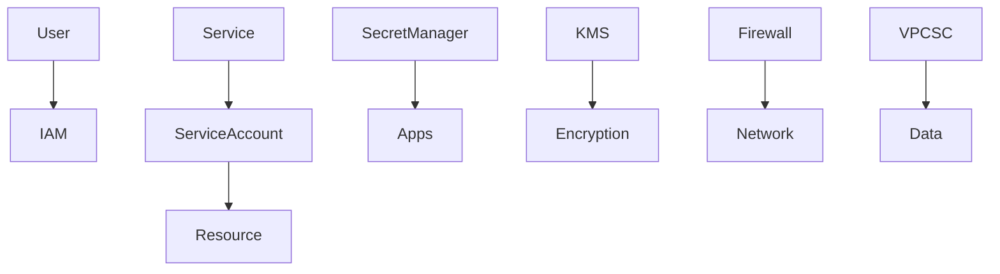
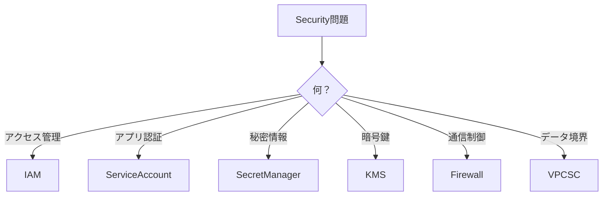

```markdown
# GCP Security（ACE 2026）

GCPのセキュリティは  
**IAM + Network + Data Protection** で構成される。

主なサービス

```

IAM
Service Accounts
Secret Manager
Cloud KMS
VPC Firewall
VPC Service Controls
Security Command Center

````

---

# Security構造

```mermaid
graph TD

Identity --> IAM
IAM --> ServiceAccounts

Network --> VPCFirewall
Network --> VPCServiceControls

Data --> SecretManager
Data --> CloudKMS

Security --> SecurityCommandCenter
````

---

# IAM（Identity and Access Management）

アクセス管理の中心。

基本構造

```
Member
↓
Role
↓
Resource
```

例

```
user:test@example.com
→ roles/viewer
→ project
```

ACE問題

```
アクセス権付与
→ IAM
```

---

# IAM Roles

ロール種類

| 種類               | 内容                      |
| ---------------- | ----------------------- |
| Basic roles      | Owner / Editor / Viewer |
| Predefined roles | サービス専用                  |
| Custom roles     | 自作                      |

ACE問題

```
最小権限
→ Predefined role
```

---

# IAM Policy

ポリシーは

```
binding
```

で構成。

例

```
member
role
condition
```

CLI

```
gcloud projects add-iam-policy-binding
```

---

# Principle of Least Privilege

最小権限。

NG

```
Owner
```

推奨

```
Viewer
Editor
Service roles
```

ACE問題

```
最小権限
→ Predefined roles
```

---

# Service Account

アプリ用ID。

用途

| 用途        | 例          |
| --------- | ---------- |
| VMアクセス    | GCE        |
| Cloud Run | APIアクセス    |
| CI/CD     | Automation |

作成

```
gcloud iam service-accounts create
```

ACE問題

```
アプリ認証
→ Service Account
```

---

# Workload Identity

GKE認証。

特徴

```
GKE Pod
↓
Service Account
↓
IAM
```

ACE問題

```
GKE認証
→ Workload Identity
```

---

# Secret Manager

秘密情報管理。

用途

| 用途      | 例        |
| ------- | -------- |
| APIキー   | API_KEY  |
| DBパスワード | password |
| トークン    | OAuth    |

ACE問題

```
パスワード管理
→ Secret Manager
```

---

# Cloud KMS

暗号鍵管理。

用途

```
Encryption key
```

利用例

| 用途                 | 例       |
| ------------------ | ------- |
| Disk encryption    | Compute |
| Storage encryption | GCS     |

ACE問題

```
鍵管理
→ Cloud KMS
```

---

# Encryption

GCP暗号化

```
At rest
In transit
```

キー種類

| 種類                    | 内容    |
| --------------------- | ----- |
| Google managed key    | デフォルト |
| Customer managed key  | KMS   |
| Customer supplied key | 自前    |

ACE問題

```
顧客管理鍵
→ CMEK
```

---

# VPC Firewall

ネットワーク制御。

ルール

```
allow
deny
```

対象

| 対象              | 例            |
| --------------- | ------------ |
| IP              | CIDR         |
| Tag             | instance tag |
| Service account | identity     |

ACE問題

```
通信制御
→ Firewall
```

---

# Private Access

Private通信。

例

```
Private Google Access
```

用途

```
VM → Google API
```

---

# VPC Service Controls

データ境界。

目的

```
Data exfiltration防止
```

対象

```
BigQuery
Storage
```

ACE問題

```
データ持ち出し防止
→ VPC Service Controls
```

---

# Security Command Center

セキュリティ統合管理。

機能

| 機能     | 内容               |
| ------ | ---------------- |
| 脆弱性    | Vulnerability    |
| 設定チェック | Misconfiguration |
| 脅威検知   | Threat detection |

ACE問題

```
セキュリティ監視
→ Security Command Center
```

---

# Securityベストプラクティス

基本

```
Least privilege
Service accounts
Secret Manager
Private networking
Audit logging
```

---

# Security Logging

監査ログ

```
Admin activity
Data access
System events
```

ACE問題

```
監査ログ
→ Audit Logs
```

---

# Security構造



---

# ACE重要ポイント

```
権限管理
→ IAM

アプリ認証
→ Service Account

秘密管理
→ Secret Manager

鍵管理
→ KMS

通信制御
→ Firewall

データ境界
→ VPC Service Controls
```

---

# ACE判断フロー



---

# ACEトラップ

## Trap1

```
アプリ認証
```

User account → ❌
Service Account → ✅

---

## Trap2

```
パスワード保存
```

Env variable → ❌
Secret Manager → ✅

---

## Trap3

```
最小権限
```

Owner → ❌
Predefined role → ✅

---

## Trap4

```
データ漏洩防止
```

Firewall → ❌
VPC Service Controls → ✅

---

# 実務TIP

実務セキュリティ基本

```
IAM
↓
Service Account
↓
Secrets
↓
Network isolation
↓
Monitoring
```

---

# まとめ

```
Identity → IAM
App auth → Service Account
Secrets → Secret Manager
Keys → KMS
Network → Firewall
Data boundary → VPC Service Controls
```

```

---

# 2026で重要なポイント

ACEでよく出るセキュリティ

```

IAM
Service Account
Secret Manager
KMS
VPC Service Controls

```

特に

```

Service Account
Secret Manager

```

は **超頻出**です。

---

# 正直な補足

ACE試験のセキュリティ問題は  
実は **この3つで8割解けます**

```

IAM
Service Account
Secret Manager

```

---
