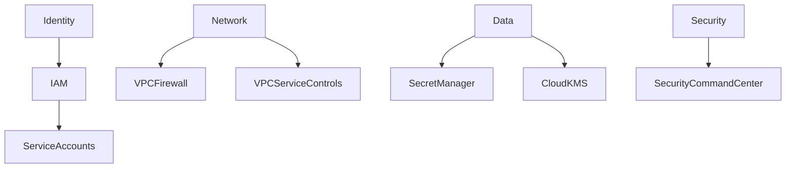
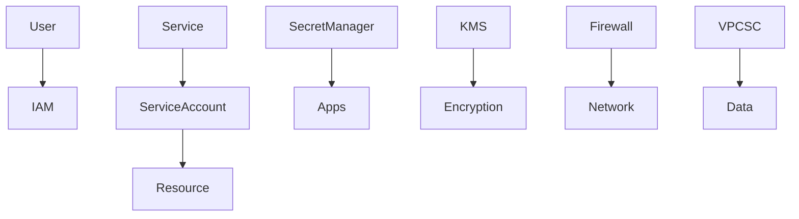
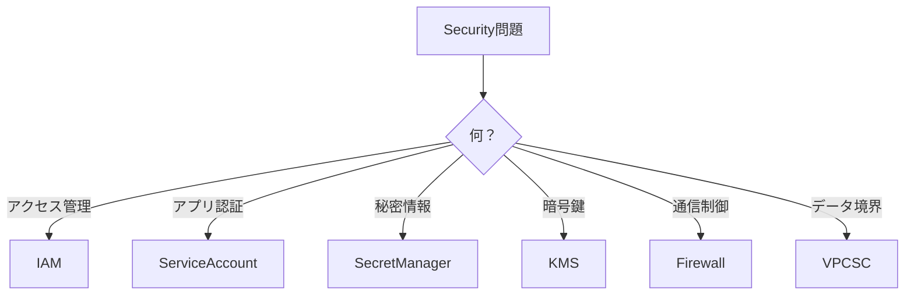

# GCP Security（ACE 2026）

---

# 1. GCP Security 概要

## 1.1 セキュリティの基本構造

GCPのセキュリティは **Identity / Network / Data Protection** の3領域で構成される。

```
Identity
Network
Data Protection
```

---

## 1.2 主なセキュリティサービス

GCPには以下のセキュリティサービスがある。

```
IAM
Service Accounts
Secret Manager
Cloud KMS
VPC Firewall
VPC Service Controls
Security Command Center
```

---

# 2. Security 全体構造



---

# 3. IAM（Identity and Access Management）

## 3.1 IAM 概要

IAMは **GCPのアクセス管理の中心サービス**。

---

## 3.2 IAMの基本構造

```
Member
↓
Role
↓
Resource
```

例

```
user:test@example.com
→ roles/viewer
→ project
```

---

## 3.3 ACE試験ポイント

```
アクセス権付与
→ IAM
```

---

# 4. IAM Roles

## 4.1 ロールの種類

| 種類               | 内容                      |
| ---------------- | ----------------------- |
| Basic roles      | Owner / Editor / Viewer |
| Predefined roles | サービス専用ロール               |
| Custom roles     | ユーザー定義ロール               |

---

## 4.2 ACE試験ポイント

```
最小権限
→ Predefined role
```

---

# 5. IAM Policy

## 5.1 IAM Policy 概要

IAMポリシーは **Binding** で構成される。

---

## 5.2 Binding構造

```
member
role
condition
```

---

## 5.3 CLI例

```
gcloud projects add-iam-policy-binding
```

---

# 6. Principle of Least Privilege

## 6.1 最小権限原則

ユーザーやサービスには **必要最小限の権限のみ付与**する。

---

## 6.2 推奨設定

NG

```
Owner
```

推奨

```
Viewer
Editor
Service roles
```

---

## 6.3 ACE試験ポイント

```
最小権限
→ Predefined roles
```

---

# 7. Service Account

## 7.1 Service Account 概要

Service Accountは **アプリケーション用のID**。

---

## 7.2 主な用途

| 用途        | 例              |
| --------- | -------------- |
| VMアクセス    | Compute Engine |
| Cloud Run | APIアクセス        |
| CI/CD     | Automation     |

---

## 7.3 作成CLI

```
gcloud iam service-accounts create
```

---

## 7.4 ACE試験ポイント

```
アプリ認証
→ Service Account
```

---

# 8. Workload Identity

## 8.1 Workload Identity 概要

Workload Identityは **GKEのPod認証機能**。

---

## 8.2 認証構造

```
GKE Pod
↓
Service Account
↓
IAM
```

---

## 8.3 ACE試験ポイント

```
GKE認証
→ Workload Identity
```

---

# 9. Secret Manager

## 9.1 Secret Manager 概要

Secret Managerは **機密情報の安全な保存サービス**。

---

## 9.2 主な用途

| 用途      | 例        |
| ------- | -------- |
| APIキー   | API_KEY  |
| DBパスワード | password |
| トークン    | OAuth    |

---

## 9.3 ACE試験ポイント

```
パスワード管理
→ Secret Manager
```

---

# 10. Cloud KMS

## 10.1 Cloud KMS 概要

Cloud KMSは **暗号鍵管理サービス**。

---

## 10.2 主な用途

```
Encryption key
```

---

## 10.3 利用例

| 用途                 | 例              |
| ------------------ | -------------- |
| Disk encryption    | Compute Engine |
| Storage encryption | Cloud Storage  |

---

## 10.4 ACE試験ポイント

```
鍵管理
→ Cloud KMS
```

---

# 11. Encryption

## 11.1 GCP暗号化

GCPはデフォルトで暗号化を提供する。

```
Encryption at rest
Encryption in transit
```

---

## 11.2 鍵の種類

| 種類                    | 内容     |
| --------------------- | ------ |
| Google-managed key    | デフォルト  |
| Customer-managed key  | KMS    |
| Customer-supplied key | ユーザー提供 |

---

## 11.3 ACE試験ポイント

```
顧客管理鍵
→ CMEK
```

---

# 12. VPC Firewall

## 12.1 Firewall 概要

VPC Firewallは **ネットワーク通信制御**を行う。

---

## 12.2 ルール

```
allow
deny
```

---

## 12.3 ルール対象

| 対象              | 例            |
| --------------- | ------------ |
| IP              | CIDR         |
| Tag             | instance tag |
| Service account | identity     |

---

## 12.4 ACE試験ポイント

```
通信制御
→ Firewall
```

---

# 13. Private Access

## 13.1 Private Google Access

VMからGoogle APIへ **プライベート通信**を可能にする。

---

## 13.2 利用例

```
VM → Google API
```

---

# 14. VPC Service Controls

## 14.1 VPC Service Controls 概要

VPC Service Controlsは **データ境界セキュリティ機能**。

---

## 14.2 目的

```
Data exfiltration 防止
```

---

## 14.3 対象サービス

```
BigQuery
Cloud Storage
```

---

## 14.4 ACE試験ポイント

```
データ持ち出し防止
→ VPC Service Controls
```

---

# 15. Security Command Center

## 15.1 SCC 概要

Security Command Centerは **GCPのセキュリティ統合管理サービス**。

---

## 15.2 主な機能

| 機能     | 内容               |
| ------ | ---------------- |
| 脆弱性検知  | Vulnerability    |
| 設定チェック | Misconfiguration |
| 脅威検知   | Threat detection |

---

## 15.3 ACE試験ポイント

```
セキュリティ監視
→ Security Command Center
```

---

# 16. Security Logging

## 16.1 Audit Logs

GCPでは監査ログが自動生成される。

---

## 16.2 ログ種類

```
Admin Activity
Data Access
System Events
```

---

## 16.3 ACE試験ポイント

```
監査ログ
→ Audit Logs
```

---

# 17. Security アーキテクチャ



---

# 18. ACE重要ポイント

```
権限管理
→ IAM

アプリ認証
→ Service Account

秘密管理
→ Secret Manager

鍵管理
→ KMS

通信制御
→ Firewall

データ境界
→ VPC Service Controls
```

---

# 19. ACE判断フロー



---

# 20. ACEトラップ

## Trap1

```
アプリ認証
```

User account → ❌
Service Account → ✅

---

## Trap2

```
パスワード保存
```

Env variable → ❌
Secret Manager → ✅

---

## Trap3

```
最小権限
```

Owner → ❌
Predefined role → ✅

---

## Trap4

```
データ漏洩防止
```

Firewall → ❌
VPC Service Controls → ✅

---

# 21. 実務TIP

実務の基本セキュリティフロー

```
IAM
↓
Service Account
↓
Secrets
↓
Network isolation
↓
Monitoring
```

---

# 22. まとめ

```
Identity → IAM
App auth → Service Account
Secrets → Secret Manager
Keys → KMS
Network → Firewall
Data boundary → VPC Service Controls
```

---

# 23. 2026 ACE重要ポイント

ACEで頻出のセキュリティサービス

```
IAM
Service Account
Secret Manager
Cloud KMS
VPC Service Controls
```

特に重要

```
Service Account
Secret Manager
```

---

# GCP Security 用語集（ACE 2026）

| 用語                      | 定義             | 用途              |
| ----------------------- | -------------- | --------------- |
| IAM                     | GCPのアクセス管理サービス | ユーザー権限管理        |
| IAM Policy              | IAM権限設定ポリシー    | RoleとMember管理   |
| Service Account         | アプリケーション用ID    | API認証           |
| Workload Identity       | GKE Pod用認証     | Kubernetesアクセス  |
| Secret Manager          | 機密情報管理サービス     | パスワード / APIキー保存 |
| Cloud KMS               | 暗号鍵管理サービス      | データ暗号化          |
| CMEK                    | 顧客管理暗号鍵        | セキュリティ強化        |
| VPC Firewall            | ネットワーク通信制御     | VM通信管理          |
| VPC Service Controls    | データ境界セキュリティ    | データ持ち出し防止       |
| Security Command Center | セキュリティ統合管理     | 脅威検知            |
| Audit Logs              | 監査ログ           | セキュリティ監査        |

---

