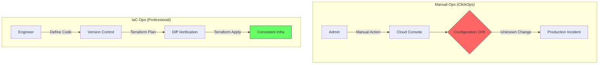

# 01. Infrastructure as Code (IaC) Concepts

## 1. Core Concept: From "Manual" to "Automated Governance"
実務におけるIaCとは、単なる作業の自動化ではない。インフラの構成を「唯一の正解（Single Source of Truth）」としてコード化し、**再現性**と**透明性**を担保するプロセスのこと。



## 2. Key Terminology (Exam & Practice)

### ① Declarative (宣言型) vs. Imperative (命令型)

* **Imperative (Ansible/Scripts):** 「手順」を指示する。「Aを作って、Bを足して、Cを設定しろ」。順序依存が強く、途中で失敗すると中途半端な状態（不整合）が残る。
* **Declarative (Terraform):** **「あるべき姿（To-Be）」**のみを記述する。「VPCが1つ、Subnetが2つある状態にしろ」。Terraformが現状（As-Is）との差分を計算し、最短経路で変更を適用する。
* **実務の眼力:** 宣言型だからこそ、設定の追加だけでなく「コードを消せばリソースが消える」という逆引きの管理が可能。

### ② Immutable (不変) vs. Mutable (可変)

* **Mutable (可変):** 既存のサーバーやNW機器にログインして設定を書き換える。長年の運用で「誰も正解がわからない秘伝のタレ」化する。
* **Immutable (不変):** 変更が必要な場合、古いリソースを修正せず、**「新しく作り直して差し替える」**。
* **実務の眼力:** `Configuration Drift`（構成の風化）を最小限に抑え、常にクリーンな状態を維持する戦略。

### ③ Idempotency (冪等性)

* **定義:** 同じコードを何回適用（Apply）しても、同じ結果が得られる性質。
* **実務の眼力:** 「既にリソースが存在するなら何もしない、なければ作る」という判断をツール側が自動で行うため、自動化パイプライン（CI/CD）に組み込める。

## 3. Business Value (実務での説得力)

| 論点 | 内容 | 実務上のメリット |
| --- | --- | --- |
| **Reproducibility** | 再現性 | 開発環境で成功したコードをそのまま本番環境に適用できる。 |
| **Traceability** | 追跡可能性 | 「いつ」「誰が」「なぜ」この設定を変えたのかがGitの履歴に残る。 |
| **Self-Documenting** | 自己文書化 | コード自体が最新の構成図（HCL）となり、Wikiの更新漏れがなくなる。 |
| **Standardization** | 標準化 | 特定の個人（職人）に依存せず、チーム全体でインフラを管理できる。 |

## 4. Exam Points (Cheatsheet)

* [ ] Terraformは**Declarative（宣言型）**である。
* [ ] Terraformは**Immutable Infrastructure**を推進する。
* [ ] IaCの目的は、コスト削減だけでなく、**リスク低減（human errorの排除）**にある。
* [ ] **State（状態管理）**が、単なるスクリプトとTerraformを分ける決定的な要素である。

```

---
