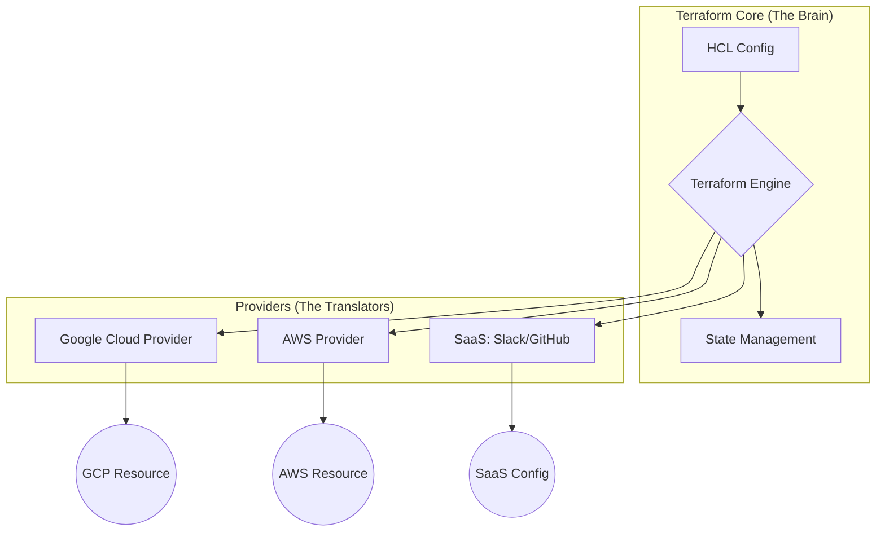

# 02. Terraform Purpose and Comparison

## 1. Why Terraform? (The Multi-Cloud Standard)
特定のクラウドベンダーに依存せず、共通のワークフロー（HCL）で複数のサービスを管理できるのが最大の強み。



## 2. Key Differentiation (実務的な棲み分け)

### ① vs. Cloud-Specific Tools (CloudFormation / CloudSDK)

* **Terraform:** マルチクラウド対応。GCPを作りながら、その情報をSlack通知に飛ばしたり、Datadogの設定まで1つのコードで完結できる。
* **ベンダーツール:** そのクラウド内では強力だが、外の世界との連携が弱い。
* **実務の眼力:** 複数のプラットフォームを跨ぐ「モダンな情シス基盤」では、Terraformによる一元管理がデファクトスタンダード。

### ② vs. Configuration Management (Ansible / Chef)

* **Ansible:** **「OS内部の管理」**（ユーザー追加、パッケージインストール）が得意。
* **Terraform:** **「インフラの器（うつわ）の管理」**（VPC、Subnet、DB、Cloud Run）が得意。
* **Pro Talk:** 「Terraformで器を作り、Ansibleで中身を整える」という分業が一般的。ただし、Immutable（不変）な運用ではAnsibleを使わず、Terraformでコンテナやイメージを差し替える。

## 3. The Role of Providers (アーキテクチャの核心)

Terraform本体は「インフラの作り方」を知らない。実際の操作は **Provider** が担当する。

* **Terraform Core:** HCLを解析し、リソースの依存関係（グラフ）を作る。
* **Providers:** 各ベンダーのAPIを叩くためのプラグイン。
* **実務の眼力:** - `terraform init` を実行した際、コードに書かれた Provider（`google`, `aws` 等）を自動でダウンロードする。
* Providerは本体とは別にリリースされるため、クラウド側の新機能への対応が非常に早い。


## 4. Business Value: "Pluggable" Infrastructure

実務において「Terraformを導入する」とは、インフラを**プラットフォーム化**することを意味する。

| 項目 | プロの視点 |
| --- | --- |
| **Skill Portability** | GCPで覚えたTerraformの作法は、AWSやAzure、SaaS管理にもそのまま転用できる。 |
| **Workflow Standardization** | どんなリソースでも `init -> plan -> apply` という共通の儀式でデプロイできる。 |
| **Ecosystem** | 巨大なコミュニティにより、大抵のSaaSには公式・非公式のProviderが存在する。 |

## 5. Exam Points (Cheatsheet)

* [ ] Terraformは**Platform Agnostic**（プラットフォームに依存しない）。
* [ ] **Terraform Core**（本体）と **Providers**（プラグイン）は疎結合である。
* [ ] `terraform init` は必要な Provider をローカルにインストールする役割を持つ。
* [ ] インフラ全体のライフサイクル管理（Orchestration）において、AnsibleよりもTerraformが選ばれる理由を理解する。

```

---
