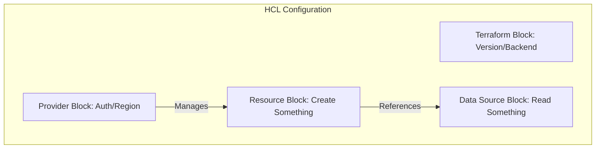

# 03. Terraform Basics (Providers, Resources, Data Sources)

## 1. The HCL Structure (Code Anatomy)
Terraformのコード（HCL）は、複数のブロックの組み合わせで構成される。



## 2. Key Blocks: 実務での役割

### ① The `terraform` Block (Global Settings)

Terraform自体のバージョン指定や、Stateファイルをどこに保存するか（Backend）を定義する。

* **実務の眼力:** バージョンを固定しないと、チームメンバー間で `tfstate` の互換性が壊れるリスクがあるため、現場では必須。

### ② The `provider` Block (The Connection)

どのクラウドのどのリージョンに、どの認証情報で接続するかを定義する。

* **実務の眼力:** 1つのコード内で「東京」と「大阪」など、複数のリージョンを使い分ける場合は、`alias` 機能を使ってProviderを複数宣言する。

### ③ The `resource` Block (The Action)

「VPCを作る」「DBを作る」といった、**「インフラの実体」**を定義する。

* **Syntax:** `resource "タイプ" "ローカル名" { ... }`
* **実務の眼力:** ローカル名はTerraform内での「参照用ラベル」であり、クラウド上の実際の名前ではない。ここを混同しないのがプロ。

### ④ The `data` Source Block (The Query)

既存のインフラ情報を**「読み取る」**ために使う。

* **実務の眼力:** Terraform管理外のリソース（手動で作られた共有VPCなど）や、最新のOSイメージIDを動的に取得する際に多用する。

## 3. Resource Dependencies (依存関係の制御)

Terraformはコードの順序に関係なく、リソース間の繋がりを自動で解析する。

| 種類 | 内容 | 実務の例 |
| --- | --- | --- |
| **Implicit (暗黙的)** | `id` などを参照して自動で紐付く | SubnetがVPCのIDを参照（Terraformが順序を判断） |
| **Explicit (明示的)** | `depends_on` で強制的に順序指定 | API有効化を待ってからリソースを作る場合 |

## 4. Business Value: "Resource Mapping"

実務において、ResourceとData Sourceを使い分けることで、大規模な環境を整理できる。

| 項目 | プロの視点 |
| --- | --- |
| **Data Fetching** | `data` ソースを駆使することで、巨大なモノリスコードを避け、プロジェクトを跨いだ連携が可能になる。 |
| **Naming Convention** | 物理リソース名とTerraformローカル名をルール化することで、保守性が劇的に向上する。 |

## 5. Exam Points (Cheatsheet)

* [ ] `resource` はリソースを**作成・更新・削除**するために使用する。
* [ ] `data` ソースは情報を**読み取る（Read-only）**ために使用する。
* [ ] `terraform init` はコード内の `provider` 設定を見てプラグインをDLする。
* [ ] リソースの依存関係は、基本的にTerraformが自動で解決する（Implicit dependency）。
* [ ] 明示的な依存関係が必要な場合は `depends_on` を使用する。

```

---

