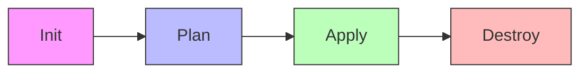

# 04. Terraform CLI Workflows

## 1. The Core Workflow (The Standard Ritual)
Terraformの運用は、常にこの4つのステップを繰り返す。



## 2. Deep Dive: 主要コマンドの実務的意義

### ① `terraform init` (The Setup)

* **役割:** ワーキングディレクトリの初期化。
* **実務の眼力:** - `provider` プラグインのダウンロード。
* `backend`（Stateの保存先）の構成。
* モジュールのダウンロード。


* **Note:** コード（`.tf`）を変更した際、特にProviderやModule、Backendの設定を変えたら必ず再実行が必要。

### ② `terraform plan` (The Dry Run)

* **役割:** 実行計画の作成。実環境（As-Is）とコード（To-Be）を比較し、差分を表示する。
* **実務の眼力:** - 実際には何も作らない（Read-only）。
* `-out=path` オプションで計画をファイルに保存できる。


* **Pro Talk:** 「Plan結果をチームでレビューしてからApplyする」のが、プロの現場の鉄則。

### ③ `terraform apply` (The Execution)

* **役割:** 計画の適用。
* **実務の眼力:** - デフォルトでは適用前に再度 `plan` を表示し、`yes` の入力を求める。
* `terraform.tfstate` を更新する。


* **Note:** CI/CDツールなどで自動実行する場合は `-auto-approve` を使うが、リスクを伴う。

### ④ `terraform destroy` (The Cleanup)

* **役割:** 管理下にある全リソースの削除。
* **実務の眼力:** - `apply` と同様に「削除計画」が表示される。
* 依存関係の逆順（安全な順番）でリソースを消していく。


## 3. Auxiliary Commands (現場で差がつく便利コマンド)

| コマンド | 実務での用途 |
| --- | --- |
| **`fmt`** | コードのインデントや整形を一括修正。GitへPushする前のマナー。 |
| **`validate`** | 構文が正しいかチェック。Providerへの接続はせず、あくまで「文法」の確認。 |
| **`show`** | 現在の State や Plan の内容を人間が読める形式で表示。 |
| **`state`** | Stateファイルの中身を操作する（リソース名の変更や削除）。 |

## 4. Business Value: "Safe Operations"

実務において CLI ワークフローを徹底することは、**「予測不能な破壊」を防ぐ**ことに直結する。

| 項目 | プロの視点 |
| --- | --- |
| **Predictability** | Apply前に「何が起きるか」を100%予見できる安心感。 |
| **Concurrency** | Backend（GCS/S3）を使っていれば、誰かがApply中に他の人が操作できないよう「Lock」がかかる。 |

## 5. Exam Points (Cheatsheet)

* [ ] `terraform init` は新しい `provider` を追加した時に必要。
* [ ] `terraform plan` はリソースを削除（Destroy）する場合も差分として表示する。
* [ ] `terraform apply` はデフォルトで `plan` の動作を内包している。
* [ ] `terraform.tfstate.lock.info` がある間は、他の操作が制限される。
* [ ] `terraform fmt` は再帰的に（`-recursive`）実行可能。

```

---
