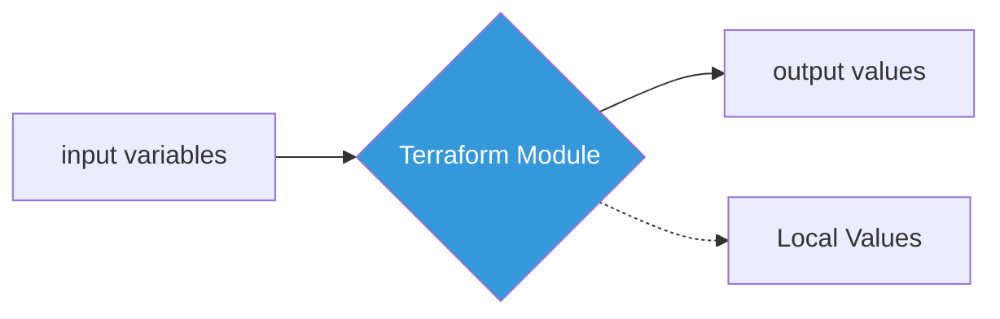

# 05. Modules and Variables (Reusability and Abstraction)

## 1. Input Variables vs. Output Values
Terraformにおけるデータの「入り口」と「出口」の管理。



* **Variables (`variable`):** 外部（CLI, ファイル, 環境変数）から渡すパラメータ。NWのIPセグメントやインスタンスサイズなど。
* **Outputs (`output`):** 構築後に表示・提供する情報。作成されたVPCのIDやLBのIPアドレスなど。
* **Locals (`locals`):** コード内で使い回す一時変数。複雑な計算や命名規則の結合に使用。

## 2. Input Variables の優先順位 (Exam Point)

実務では「どこで定義した値が勝つか」の把握が事故を防ぐ。

1. **`-var` or `-var-file**` (CLIオプション) ← 最優先
2. **`*.auto.tfvars`**
3. **`terraform.tfvars`**
4. **環境変数** (`TF_VAR_名称`)

## 3. Terraform Modules (インフラの部品化)

特定の機能（例：標準的なVPC＋Subnetのセット）をパッケージ化して再利用する仕組み。

* **Root Module:** `terraform apply` を実行するディレクトリ。
* **Child Module:** Rootから呼び出される部品。
* **Module Source:** ローカルパス、GitHub、Terraform Registryなどから取得可能。

### 実務のメリット

* **Standardization:** チーム共通の「社内標準NW構成」をModule化し、誰でも同じ品質で構築可能にする。
* **Encapsulation:** 複雑なリソース群を1つの「Moduleブロック」に隠蔽し、Rootコードをスッキリさせる。

## 4. Collection Types (変数型)

実務で多用する複雑な型を整理。

| 型 | 内容 | 実務の例 |
| --- | --- | --- |
| **list** | 順序がある配列 | `["10.0.1.0/24", "10.0.2.0/24"]` |
| **map** | キーと値のペア | `{ env = "prod", region = "tokyo" }` |
| **object** | 異なる型の組み合わせ | `struct`に近い。複雑なリソース設定をまとめて渡す。 |

## 5. Exam Points (Cheatsheet)

* [ ] **Modules** を使うと、コードの重複を避け、管理を簡素化できる。
* [ ] Moduleを使用する際は、まず `terraform init` でソースをダウンロードする必要がある。
* [ ] `variable` には `default` 値を設定でき、指定がない場合はその値が使われる。
* [ ] `output` は他のModuleから参照したり、構築後に情報をダンプするために使う。
* [ ] **Sensitive Flag:** `variable` や `output` に `sensitive = true` を付けると、ログに値が表示されない（パスワード等に必須）。

```

---

