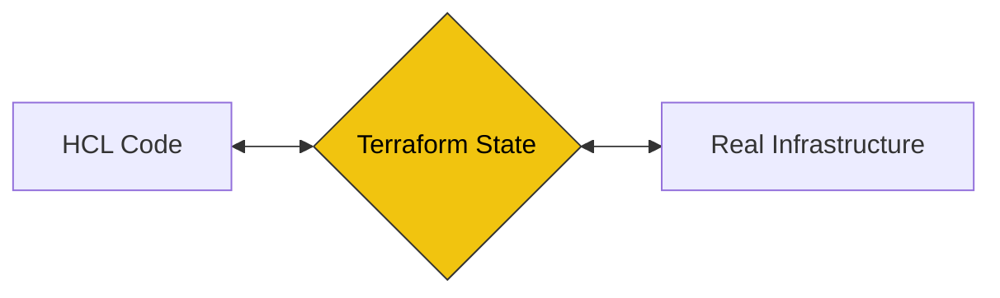

# 06. State Management (The Brain of Terraform)

## 1. What is "State"? (The Source of Truth)
Terraformは、コードと実際のインフラを紐付けるために `terraform.tfstate` というJSONファイルを使用する。



* **Mapping:** コード上の `resource "google_compute_network" "vpc"` が、実際のGCP上のどのIDを指しているかを記録。
* **Metadata:** リソースの依存関係や属性（IPアドレス、作成日時など）を保持。
* **Performance:** 大規模環境で毎回クラウドAPIを叩くと遅いため、Stateをキャッシュとして利用する。

## 2. Remote State & Backends (チーム運用の鉄則)

ローカルのPCに `tfstate` を置いておくと、チーム開発で詰む（最新の状態が共有されない、誤って消す）。

### ① Remote Backend

GCS (Google Cloud Storage) や S3 に State を保存する仕組み。

* **Shared Access:** チーム全員が常に「最新の台帳」を参照できる。
* **Security:** StateにはDBのパスワードなどの機密情報が含まれるため、クラウド上の暗号化バケットで守る。

### ② State Locking (二重更新防止)

誰かが `apply` 中に別の人が `apply` すると、Stateが壊れる可能性がある。これを防ぐのが **Locking**。

* **GCS/S3+DynamoDB:** 操作中にロックをかけ、他者の書き込みを拒否する。
* **実務の眼力:** 突然PCがフリーズしてロックが残った場合、`terraform force-unlock` で解除する儀式が必要になる。

## 3. Advanced State Operations (プロの修復術)

実務では「コードと実機がズレた」時の修正作業が頻発する。

| コマンド | 実務での用途 |
| --- | --- |
| **`terraform import`** | **最重要。** 手動で作ったリソースをStateに取り込み、管理下に置く。 |
| **`terraform state mv`** | リソースのコード上の名前を変更した場合に、Stateとの紐付けを修正する（作り直しを避ける）。 |
| **`terraform state rm`** | リソースは消さずに、Terraformの管理対象から外す（Stateから削除する）。 |
| **`terraform refresh`** | 実機を見に行き、Stateを最新に更新する（※現在はplan時に自動で行われる）。 |

## 4. Business Value: "Disaster Recovery & Consistency"

Stateを正しく管理することは、インフラの「家計簿」を守ることに等しい。

| 項目 | プロの視点 |
| --- | --- |
| **Environment Isolation** | 本番（Prod）と開発（Dev）でStateを分けることで、事故の影響を局所化する。 |
| **Audit Trail** | Cloud Storageのバージョニング機能を使えば、Stateの過去履歴を辿れる（構成のタイムトラベル）。 |

## 5. Exam Points (Cheatsheet)

* [ ] Stateにはパスワードなどの**機密情報**がプレーンテキストで含まれる場合がある。
* [ ] **Remote Backend** を使う主な理由は「チーム共有」と「Locking」。
* [ ] `terraform import` はコード（.tf）を自動生成しない（※v1.5以降は一部可能だが、試験では「Stateのみ更新」と覚える）。
* [ ] `terraform.tfstate.backup` はローカル実行時に自動生成される。
* [ ] Backendの設定変更後は必ず `terraform init` を再実行する。

```

---

