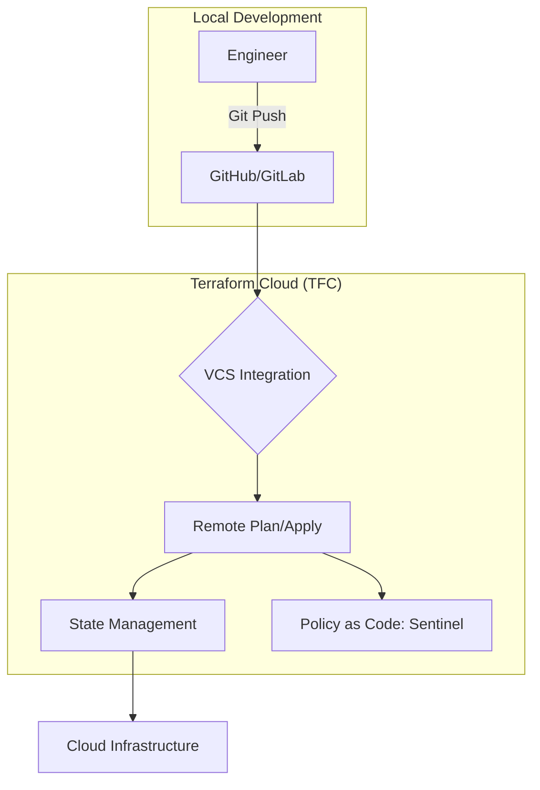

# 07. Terraform Cloud and Enterprise

## 1. Why Terraform Cloud (TFC)?
個人やローカルPCでの実行を卒業し、チームで安全にIaCを運用するためのマネージドプラットフォーム。



## 2. Key Features (組織運用の武器)

### ① Remote Execution

* **役割:** 自分のPCではなく、TFC上のクリーンな環境でTerraformを実行する。
* **実務の眼力:** 「誰の環境でも動く」状態を担保し、個人のPC環境に依存するトラブルを排除する。

### ② Workspaces

* **役割:** 同じコードを使いつつ、環境（Prod / Staging / Dev）ごとにStateを完全に切り分ける箱。
* **実務の眼力:** 情シスの現場では「本番用Workspace」には特定の管理者しかApplyできないといった権限分離に活用する。

### ③ Sentinel (Policy as Code)

* **役割:** 「セキュリティ的にNGな設定」を事前に防ぐ検閲機能。
* **実務の例:**
* 「パブリックIPを持つインスタンスの作成を禁止する」
* 「特定の時間外（土日など）の変更を拒否する」


* **Note:** これは **Terraform Enterprise/Cloud の有償版機能** であることが試験で問われやすい。

### ④ Private Module Registry

* **役割:** 自社専用にカスタマイズした「標準モジュール」を組織内で共有・カタログ化する。

## 3. Terraform Cloud vs. Enterprise

実務での選定基準。

| 項目 | Terraform Cloud (TFC) | Terraform Enterprise (TFE) |
| --- | --- | --- |
| **提供形態** | SaaS (HashiCorp管理) | セルフホスト (自社VPC内等に構築) |
| **主な用途** | 一般的なクラウド運用 | 厳しいコンプライアンスや閉域網必須の企業 |

## 4. Business Value: "Governance at Scale"

実務においてTFCを導入する最大の理由は、**「自由と統制のバランス」**にある。

| 項目 | プロの視点 |
| --- | --- |
| **Team Collaboration** | 誰がいつApplyしたかの履歴がGUIで残り、監査（オーディット）に対応できる。 |
| **Cost Estimation** | Plan時に「この変更で月額いくら増えるか」を自動計算してくれる（※TFCの機能）。 |
| **Security** | クラウドの認証情報を個人のPCに置かず、TFCの環境変数に秘匿して管理できる。 |

## 5. Exam Points (Cheatsheet)

* [ ] **Sentinel** はプロアクティブ（事前）なポリシーチェックを行う。
* [ ] **Workspaces** を使うことで、1つのディレクトリで複数のStateを管理できる。
* [ ] Terraform Cloud はデフォルトで **Remote Backend** として機能する。
* [ ] **VCS Integration**（GitHub連携等）により、プルリクエスト時に自動で `plan` を走らせることができる。
* [ ] **Variable Sets** を使えば、複数のプロジェクト（Workspace）で共通の認証情報を使い回せる。

```

---

