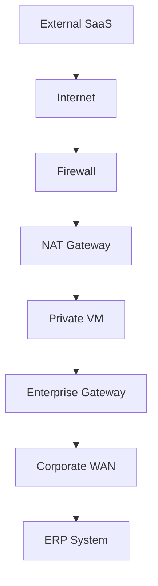

# Enterprise Network Integration Pattern

(SFTP / NAT / Hybrid Network)

対象

```
SC（情報処理安全確保支援士）
NW（ネットワークスペシャリスト）
Enterprise Cloud Architecture
```

---

# 1 Enterprise Network の基本構造

エンタープライズネットワークは

```
Internet
Cloud
Corporate Network
```

の3層で構成される。

AA図

```
          Internet
              │
              │
        ┌─────▼─────┐
        │ Firewall  │
        │ Security  │
        └─────┬─────┘
              │
        ┌─────▼─────┐
        │ NAT GW    │
        │ 固定IP     │
        └─────┬─────┘
              │
        ┌─────▼─────┐
        │ Private VM │
        │ Batch/API  │
        └─────┬─────┘
              │
       Enterprise Gateway
              │
              ▼
       Corporate WAN
              │
              ▼
             ERP
```

SCタグ

```
#Firewall
#NAT
#閉域網
#DMZ
```

---

# 2 セキュリティ設計原則

ネットワーク設計の基本

```
Inbound  → 原則拒否
Outbound → 必要通信のみ許可
```

理由

```
Inbound  = 攻撃入口
Outbound = 情報漏洩経路
```

SCタグ

```
#アクセス制御
#FW
#ゼロトラスト
```

---

# 3 VM公開設計

クラウド設計では

```
VMにPublic IPを付与しない
```

構造

```
Internet
   │
Firewall
   │
NAT
   │
Private VM
```

メリット

```
攻撃面削減
セキュリティ統制
ログ集中
```

SCタグ

```
#DMZ
#NAT
#FW
```

---

# 4 SaaS連携パターン

Outbound通信

```
Private VM
   │
   ▼
NAT Gateway
   │
   ▼
Internet
   │
   ▼
External SaaS
```

ポイント

```
接続元IP
= NAT固定IP
```

SCタグ

```
#NAT
#IP制御
#FW
```

---

# 5 SFTP連携

SFTP

```
SSHベース
```

通信

```
TCP 22
```

構造

```
Integration Server
      │
      │ SFTP
      ▼
Vendor SFTP
```

典型要件

| 要件   | 理由       |
| ---- | -------- |
| 固定IP | 接続元制限    |
| 公開鍵  | セキュリティ   |
| IP制御 | 不正アクセス防止 |
| ログ   | 監査       |

SCタグ

```
#公開鍵認証
#SSH
#認証
```

---

# 6 NAT設計

クラウドVM

```
Private IP
```

外部接続

```
Global IP
```

そのため

```
NAT
```

構造

```
Private VM
   │
   ▼
NAT Gateway
   │
   ▼
Internet
```

SCタグ

```
#NAT
#IP変換
```

---

# 7 閉域ネットワーク

企業ネットワークでは

```
Closed Network
```

例

```
MPLS
Carrier Network
SD-WAN
```

構造

```
VM
 │
 ▼
Enterprise Gateway
 │
 ▼
Closed Network
 │
 ▼
ERP
```

特徴

```
Internetを通らない
```

SCタグ

```
#VPN
#閉域網
#IPsec
```

---

# 8 Enterprise Hybrid Network

Mermaid図



SCタグ

```
#FW
#NAT
#VPN
#DMZ
```

---

# 9 SFTP設計チェック

| 項目    | 内容                 |
| ----- | ------------------ |
| 通信方向  | Inbound / Outbound |
| 接続元IP | 固定IP               |
| プロトコル | SFTP               |
| ポート   | 22                 |
| 認証    | SSH鍵               |
| ログ    | 接続ログ               |

---

# 10 SFTP設計トラブル

### NAT未設定

```
接続不可
```

---

### IP登録ミス

```
接続拒否
```

---

### 鍵ミス

```
Authentication failed
```

---

### FWポート閉鎖

```
Connection timeout
```

---

# まとめ

Enterprise Integration

```
Private VM
     │
     ▼
NAT Gateway
     │
     ▼
Internet
     │
     ▼
External System
```

内部連携

```
VM
 │
 ▼
Enterprise Gateway
 │
 ▼
Closed Network
 │
 ▼
ERP
```

設計原則

```
VM非公開
Inbound最小化
Outbound制御
```

---

