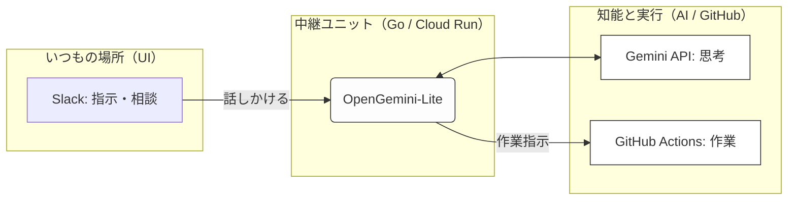
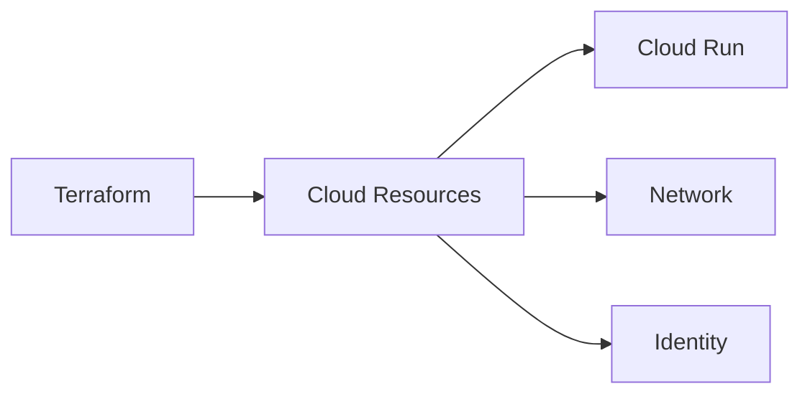
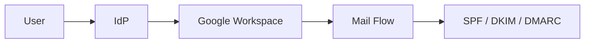
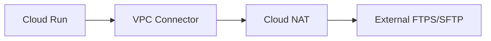

# Tech Inventory

本リポジトリは、
業務上必要となった構成・設計・実装を
**記録として整理したもの**です。

特定の技術スタックやプロダクトを誇示する意図はなく、
再現性・説明可能性・運用性を重視しています。

※ 実験的に、イベント駆動型の自動化基盤についても検証を行っています。

---

# 🌌 Development Public / 2026 Innovation Layer

## コンセプト：AIと現場を「直結」する

**「話したことが、そのまま資産になる」**

AIとの対話を「ただのチャット」で終わらせないための、実務直結型パイプライン。
Slackという日常の場から、Geminiの知性とGitHubの実行力をつなぐ。
人の手によるコピー＆ペーストを排除し、意志をシームレスに成果物へと変換します。

---

## 🛠️ 主な機能と特徴

* **進化し続けるAI（思考ユニット）**
最新モデル `gemini-flash-latest` を採用。AI側の進化に自動で追従するため、メンテナンスの手間をかけずに常に最新の知能を使い続けることが可能です。
* **待ち時間のない並行処理（Go言語）**
Go言語の強みである並列処理を活用。AIが深く考えている間も、システムは即座に応答。Slack特有のタイムアウト制限を気にせず、リズムを崩さない業務体験を提供します。
* **「会話」を「実行」に変える自動連携**
GitHub Actionsとの高度な連携。Slackでのやり取りの延長線上で、ドキュメントの作成やファイルの保存、インフラの操作までを完結させます。
* **変化に強い「分離設計」**
「考える（AI）」と「動く（システム）」を切り離して構成。将来、別のAIや別のプラットフォームに乗り換える際も、最小限の修正で対応できる高い拡張性を備えています。

---

## 📊 システムの流れ

---

### 📖 Design Philosophy & Deep Dive

▶︎ Architecture
[https://github.com/conti0513/development_public/blob/main/02_ARCHITECTURE/04_IAC_TERRAFORM/Terraform/design_docs/31_AI_AGENT_OPENGEMINI_LITE.md](https://github.com/conti0513/development_public/blob/main/02_ARCHITECTURE/04_IAC_TERRAFORM/Terraform/design_docs/31_AI_AGENT_OPENGEMINI_LITE.md)

---

### Infrastructure as Code

クラウド基盤を
コードとして管理するための設計と実装。

* Terraform による構成管理
* Cloud Run / Network / Identity を含む構成
* 設計資料とコードの対応関係を保持

▶︎ Architecture
[https://github.com/conti0513/development_public/tree/main/02_ARCHITECTURE](https://github.com/conti0513/development_public/tree/main/02_ARCHITECTURE)

---

### Security / Identity / Mail

認証・認可・メール基盤まわりの整理。

* Google Workspace / IdP 連携
* SPF / DKIM / DMARC の運用設計
* 検証結果を前提とした記録

▶︎ Identity / SSO
[https://github.com/conti0513/development_public/tree/main/02_ARCHITECTURE/02_IDENTITY_ACCESS/gws-idp](https://github.com/conti0513/development_public/tree/main/02_ARCHITECTURE/02_IDENTITY_ACCESS/gws-idp)

▶︎ Mail / Security
[https://github.com/conti0513/development_public/tree/main/02_ARCHITECTURE/03_SECURITY_MAIL](https://github.com/conti0513/development_public/tree/main/02_ARCHITECTURE/03_SECURITY_MAIL)

---

### Secure File Transfer

FTP / SFTP を含む
ファイル連携基盤の構成検討。

* Cloud Run + VPC Connector + NAT
* 固定IPを前提とした外部連携
* 実運用を想定した分離構成

▶︎ Serverless FTPS / SFTP
[https://github.com/conti0513/development_public/tree/main/02_ARCHITECTURE/01_PLATFORM_CLOUD/serverless-ftps-api-public](https://github.com/conti0513/development_public/tree/main/02_ARCHITECTURE/01_PLATFORM_CLOUD/serverless-ftps-api-public)

---

## Background

インフラ／ネットワーク／ID 基盤を中心に業務経験。

現場で必要になったものを整理し、
使える形で残しています。

現在は、エンタープライズ規模の環境に向けた
GCP / Terraform / Identity / セキュリティガバナンス
およびイベント駆動型自動化基盤の設計に注力しています。

---
