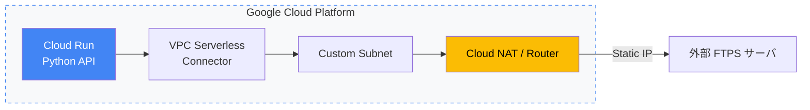

# 🌐 モダン・クラウドアーキテクチャ & 技術ログ

本リポジトリでは、Google Cloud（Cloud Run / VPC）を中心とした
インフラ構築パターンや、AIと協調しながら行った技術検証・試行錯誤の記録を公開しています。

---

## 🚀 代表的な構成例：Cloud Run & セキュアネットワーク

サーバーレス環境における
固定IP（Egress制御）を伴うセキュアなネットワーク構成の実装例です。

---

## 🛠 技術スタック / アプローチ

- Cloud: Google Cloud（Cloud Run / VPC / Cloud NAT / Cloud SQL）
- Languages: Python / Shell Script / Go（継続学習中）
- AI活用: Gemini / GitHub Copilot による設計支援・壁打ち・ドキュメント即時化

---

## 📂 コンテンツ一覧

- TIL（Today I Learned）: ./TIL/
  日々の技術的な課題、トラブル対応、学びの記録

- Project Examples: ./project_examples/
  業務自動化・インフラ構築の具体例

- DevOps Notes: ./devops_notes/
  Docker / Terraform / セキュリティ運用メモ

---

## 🏗 リポジトリ構成

運用知識を再利用可能かつ構造的に管理することを目的とした構成です。

TIL/
  entries/2025/...    日次ログ
  create_til_entry.sh
  til_git_push.sh

devops_notes/
  terraform/          IaC 検証・設計
  cloud/              AWS / GCP
  docker/             Docker 環境
  python/             Python ユーティリティ
  security/           セキュリティ運用

project_examples/
  daily-sheet-to-slack/
  gws_auto_py/
  windows_setup_automation/

---

## 📝 補足

現在は技術の棚卸しとポートフォリオ整理フェーズにあり、
次のチャレンジに向けた準備を進めています。
