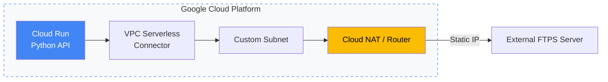

# 🌐 Modern Cloud Architecture & Technical Logs

This repository documents infrastructure design patterns centered on **Google Cloud (Cloud Run / VPC)**  
and technical experiments conducted in collaboration with AI tools.

---

## 🚀 Featured Architecture: Cloud Run & Secure Network

An example of a secure serverless network architecture with **static IP and controlled egress**.



---

## 🛠 Core Stack & Methodologies

* **Cloud:** Google Cloud (Cloud Run, VPC, Cloud NAT, Cloud SQL)
* **Languages:** Python / Shell Script / Go *(ongoing)*
* **AI Collaboration:** Gemini / GitHub Copilot for rapid design iteration and real-time documentation support

---

## 📂 Main Content Index

* **[TIL (Today I Learned)](./TIL/)**  
  Continuous logs since late 2025, capturing daily problem-solving and technical insights.

* **[Project Examples](./project_examples/)**  
  Practical implementations for infrastructure automation and operational tooling.

* **[DevOps Notes](./devops_notes/)**  
  Knowledge base covering Docker, Terraform, and security-related practices.

---

## 🏗 Repository Structure

Overall directory layout of this repository.  
The goal is to manage operational knowledge in a **reusable and structured** manner.

```bash
TIL/
  ├── entries/2025/...    # Daily logs
  ├── create_til_entry.sh
  └── til_git_push.sh

devops_notes/
  ├── terraform/          # IaC sandbox & design docs
  ├── cloud/              # Cloud notes (AWS / GCP)
  ├── docker/             # Docker environments & automation
  ├── python/             # Python utilities
  └── security/           # Security operation notes

project_examples/
  ├── daily-sheet-to-slack/        # GAS: daily report → Slack
  ├── gws_auto_py/                 # Python-based GWS automation
  └── windows_setup_automation/    # Windows setup automation
```

---

## 📝 Note

This repository is currently being refined as part of a **technical inventory and portfolio consolidation**,  
while preparing for the next phase of professional challenges.
