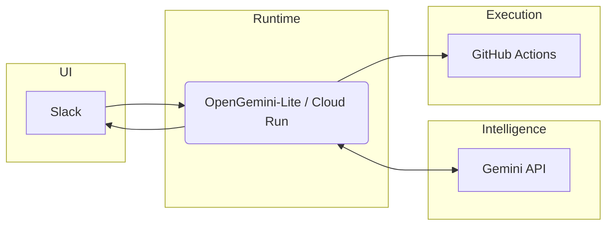
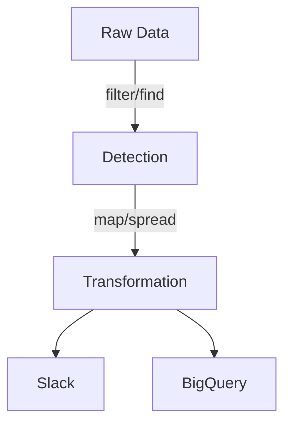
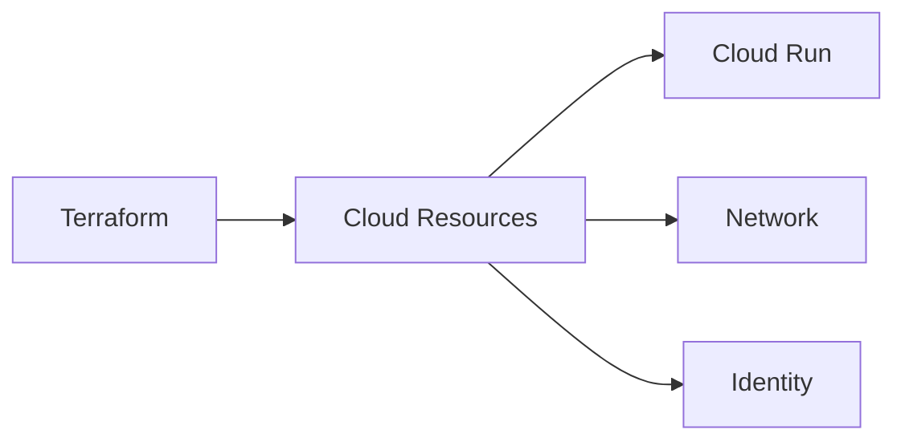
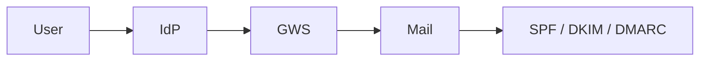
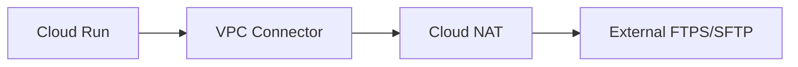

# Tech Inventory

本リポジトリは、
業務上必要となった構成・設計・実装を
**記録および再現可能な形で整理したもの**です。

特定の技術スタックやプロダクトを誇示する意図はありません。
重視しているのは以下の3点です。

* 再現性（Reproducibility）
* 説明可能性（Explainability）
* 運用性（Operability）

また、実験的にイベント駆動型の自動化基盤についても検証を行っています。

---

# OpenGemini-Lite

SlackメモのGitHub資産化エージェント

## 概要

Slack上のメモ・相談・設計思考を、
AI処理を経由してGitHubへ保存する自動化パイプライン。

目的は、

> 「会話を記録で終わらせず、成果物へ変換すること」

コピー＆ペーストを介さず、
Slack → AI → GitHub を直接接続する構成です。

---

## 技術構成

* Runtime: Go (1.22+)
* Hosting: Cloud Run
* AI: Gemini API
* SCM: GitHub Actions
* Trigger: Slack Events API

---

## 主な設計ポイント

### 1. 非同期処理によるSlack制約回避

Slackの3秒応答制限に対し、

* 即時200 OKを返却
* AI処理はGoroutineで非同期実行

業務体験を阻害しない設計としています。

---

### 2. AI出力の安全な転送

GitHub Actionsへのデータ送信は
Base64エンコードにより文字制約を回避。

* 特殊文字による破損防止
* YAMLインジェクション対策の一助

---

### 3. モデル追従性

`gemini-flash-latest` を採用。

モデルバージョンを固定せず、
API側の進化に追従可能な設計としています。

---

## システム構成

---

### Architecture Documentation

▶︎ AI Agent Design
[https://github.com/conti0513/development_public/blob/main/02_ARCHITECTURE/04_IAC_TERRAFORM/Terraform/design_docs/31_AI_AGENT_OPENGEMINI_LITE.md](https://github.com/conti0513/development_public/blob/main/02_ARCHITECTURE/04_IAC_TERRAFORM/Terraform/design_docs/31_AI_AGENT_OPENGEMINI_LITE.md)

---

# JavaScript / ChatOps Implementation

Node.js 環境における、ChatOps基盤の設計および実装。

## 主な内容

* Slack Bolt SDK によるアプリ実装
* Cloud Run 上でのスケーラブル構成
* Slash Command 起点の処理設計
* BigQuery とのデータパイプライン構築

---

## データ処理設計

JavaScript 高階関数を活用した
非破壊的なデータ処理ロジック。

* `filter`
* `map`
* `find`
* `some`
* `every`

ガード句および論理演算子を活用し、
可読性と安全性を重視しています。

▶︎ Implementation
[https://github.com/conti0513/development_public/tree/main/03_IMPLEMENTATIONS/05_ENTERPRISE_IT_OPERATIONS/04_SAAS_OPS_REFACTORING](https://github.com/conti0513/development_public/tree/main/03_IMPLEMENTATIONS/05_ENTERPRISE_IT_OPERATIONS/04_SAAS_OPS_REFACTORING)

---

# Infrastructure as Code

クラウド基盤をコードとして管理する設計・実装。

## 対象領域

* Terraform による構成管理
* Cloud Run / Network / Identity
* State管理およびガードレール設計

設計資料と実装コードの対応関係を明示しています。

▶︎ Architecture
[https://github.com/conti0513/development_public/tree/main/02_ARCHITECTURE](https://github.com/conti0513/development_public/tree/main/02_ARCHITECTURE)

---

# Security / Identity / Mail

認証・認可・メール基盤の整理および検証記録。

## 内容

* Google Workspace / IdP 連携
* SPF / DKIM / DMARC 設計
* 変更時の検証ログ

▶︎ Identity / SSO
[https://github.com/conti0513/development_public/tree/main/02_ARCHITECTURE/02_IDENTITY_ACCESS/gws-idp](https://github.com/conti0513/development_public/tree/main/02_ARCHITECTURE/02_IDENTITY_ACCESS/gws-idp)

▶︎ Mail / Security
[https://github.com/conti0513/development_public/tree/main/02_ARCHITECTURE/03_SECURITY_MAIL](https://github.com/conti0513/development_public/tree/main/02_ARCHITECTURE/03_SECURITY_MAIL)

---

# Secure File Transfer

FTP / SFTP を含む外部連携基盤の検討。

## 構成例

* Cloud Run
* VPC Connector
* Cloud NAT
* 固定IP前提の外部接続

実運用を想定したネットワーク分離構成で設計。

▶︎ Serverless FTPS / SFTP
[https://github.com/conti0513/development_public/tree/main/02_ARCHITECTURE/01_PLATFORM_CLOUD/serverless-ftps-api-public](https://github.com/conti0513/development_public/tree/main/02_ARCHITECTURE/01_PLATFORM_CLOUD/serverless-ftps-api-public)

---

# Background

インフラ／ネットワーク／Identity基盤を中心とした業務経験。

現場で必要になった構成を整理し、
再利用可能な形で記録しています。

現在は、

* GCP
* Terraform
* Identity / Security Governance
* イベント駆動型自動化基盤

の設計および実装検証に注力しています。

---
