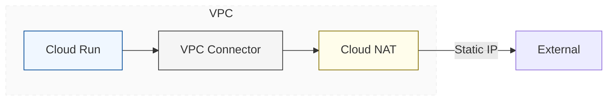
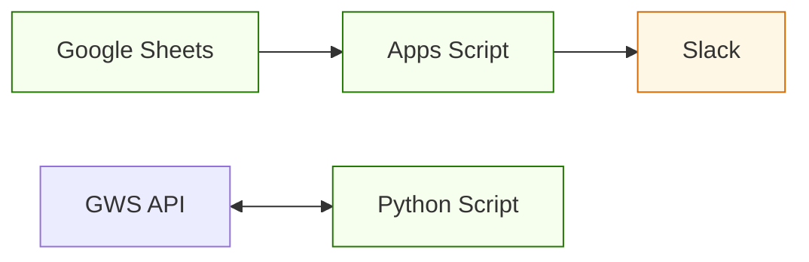
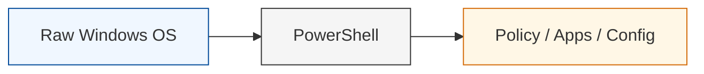

# Tech Inventory & Logs

インフラの構造化と、運用プロセスの記録。

---

### Implementation Archives

サーバーレス基盤の構築から、現場の負債を解消する自動化まで。

#### 1. [Cloud Run / Secure Egress](https://github.com/conti0513/development_public/tree/main/devops_notes/serverless-ftps-api-public)

#### 2. [GWS / Slack Automation](https://github.com/conti0513/development_public/tree/main/project_examples/daily-sheet-to-slack)

#### 3. [Windows Setup Automation](https://github.com/conti0513/development_public/tree/main/project_examples/windows_setup_automation)

---

### Stacks

* **Infrastructure:** Google Cloud, AWS, Entra ID, M365 (Intune)
* **Governance:** ITGC Compliance, Identity Management
* **Automation:** Python, PowerShell, GAS, LLM Orchestration

---

### Contents

* **[TIL](https://www.google.com/search?q=./TIL/)** : 2025- / 技術的な試行錯誤の軌跡
* **[DevOps Notes](https://www.google.com/search?q=./devops_notes/)** : Cloud, Security, Automation, IaC
* **[Project Examples](https://www.google.com/search?q=./project_examples/)** : 実装プロトタイプ

---

### Profile

20年余のインフラ経験。通信キャリアのNW設計から、大規模組織のID基盤運用、スタートアップの自動化まで。

「技術を、一過性の作業ではなく、再利用可能な構造として残すこと」を旨とする。

---
