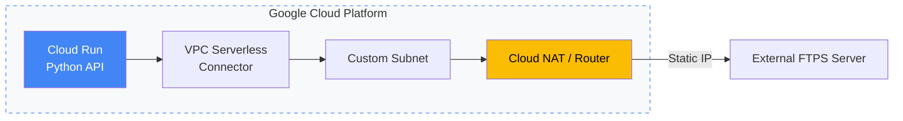

```markdown
# 🌐 Modern Cloud Architecture & Technical Logs
GCP（Cloud Run / VPC）を中心としたインフラ構築パターンと、AIとの協調による技術検証の記録を公開しています。

---

### 🚀 Featured Architecture: Cloud Run & Secure Network
サーバーレス環境におけるセキュアなネットワーク構成（固定IP/Egress制御）の実装例です。



### 🛠 Core Stack & Methodologies

* **Cloud:** Google Cloud (Cloud Run, VPC, Cloud NAT, Cloud SQL)
* **Languages:** Python / Shell Script / Go (Ongoing)
* **AI-Collaboration:** Gemini / GitHub Copilot を活用した設計の迅速化とドキュメントの即時同期。

---

### 📂 Main Content Index

* **[TIL (Today I Learned)](https://www.google.com/search?q=./TIL/)**: 2025年後半より継続。日々の技術的な課題解決と試行錯誤のプロセスを記録。
* **[Project Examples](https://www.google.com/search?q=./project_examples/)**: 業務自動化・インフラ構築の具体的な実装サンプル。
* **[DevOps Notes](https://www.google.com/search?q=./devops_notes/)**: 各種技術スタック（Docker / Terraform / Security）のナレッジベース。

---

### 🏗 Repository Details (DIR Structure)

本リポジトリの全体構成です。運用知識を再利用可能かつ構造的に管理することを目指しています。

```bash
TIL/
  ├── entries/2025/...    # Daily logs
  ├── create_til_entry.sh
  └── til_git_push.sh

devops_notes/
  ├── Terraform/          # IaC Sandbox & Design Docs
  ├── cloud/              # Cloud notes (AWS / GCP)
  ├── docker/             # Docker environment & automation
  ├── python/             # Python utilities
  └── security/           # Security operation notes

project_examples/
  ├── daily-sheet-to-slack/        # GAS: daily report → Slack
  ├── gws_auto_py/                 # Python GWS automation
  └── windows_setup_automation/    # Windows setup automation

```

---

### 📝 Note

現在、技術の棚卸しと並行して、新たなチャレンジに向けたポートフォリオの整理を行っています。

```

