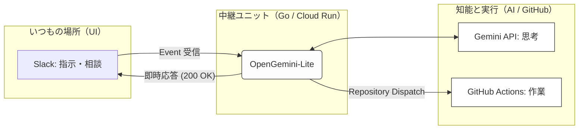
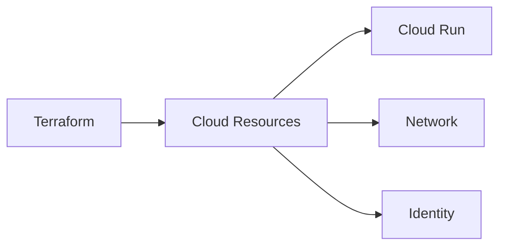
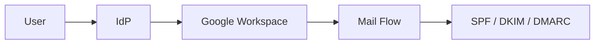
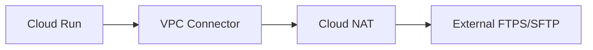

# Tech Inventory

本リポジトリは、
業務上必要となった構成・設計・実装を
**記録として整理したもの**です。

特定の技術スタックやプロダクトを誇示する意図はなく、
再現性・説明可能性・運用性を重視しています。

※ 実験的に、イベント駆動型の自動化基盤についても検証を行っています。

---

「2026 Innovation Layer」も格好いいですが、実務リポジトリとしては**「何ができる場所なのか」**が直感的に伝わる名前がベストですね。

いくつかトーン別に案を出します。リポジトリの性格に合うものを選んでみてください。

---

### 案1：直球・実務型（中身がすぐわかる）

> **# OpenGemini-Lite：SlackメモのGitHub資産化エージェント**
> *副題：会話をドキュメントに変え、GitHub PRへ自動蓄積するパイプライン*

### 案2：コンセプト重視型（価値が伝わる）

> **# Insight-to-Asset Pipeline：閃きを資産に変える**
> *副題：Slack連携型 AIナレッジマネジメント・システム*

### 案3：シンプル・モダン型（洗練された印象）

> **# OpenGemini-Lite / Auto-Documenter**
> *副題：Gemini × Cloud Run × GitHub による自律型ドキュメンテーション*

---

# 🌌 OpenGemini-Lite：SlackメモのGitHub資産化エージェント

## コンセプト：AIと現場を「直結」する

**「話したことが、そのまま資産（アセット）になる」**

AIとの対話を「ただのチャット」で終わらせないための、実務直結型パイプライン。
Slackという日常の場から、Geminiの知性とGitHubの実行力をつなぎます。
人の手によるコピー＆ペーストを排除し、意志をシームレスに成果物へと変換します。

---

## 🛠️ 主な機能と特徴

* **進化し続けるAI（思考ユニット）**
最新モデル `gemini-flash-latest` を採用。AI側の進化に自動で追従するため、メンテナンスの手間を最小限に抑えつつ、常に最適な知能を利用可能です。
* **非同期・並行処理による安定稼働（Go 1.22+）**
Go言語の並列処理（Goroutine）を活用。AIの長考を許容しつつ、Slackの応答制限（3秒）を即座にクリア。業務のリズムを崩さないシームレスな体験を提供します。
* **「会話」を「実行」に変える自動連携**
GitHub Actions との高度な連携。Base64符号化によるセキュアなデータ転送により、AIが生成したコードや文書を、特殊文字の制約なく正確にリポジトリへ保存します。

---

## 📊 システムの流れ

---

### 📖 Design Philosophy & Deep Dive

▶︎ Architecture
[https://github.com/conti0513/development_public/blob/main/02_ARCHITECTURE/04_IAC_TERRAFORM/Terraform/design_docs/31_AI_AGENT_OPENGEMINI_LITE.md](https://github.com/conti0513/development_public/blob/main/02_ARCHITECTURE/04_IAC_TERRAFORM/Terraform/design_docs/31_AI_AGENT_OPENGEMINI_LITE.md)

---

### Infrastructure as Code

クラウド基盤を
コードとして管理するための設計と実装。

* Terraform による構成管理
* Cloud Run / Network / Identity を含む構成
* 設計資料とコードの対応関係を保持

▶︎ Architecture
[https://github.com/conti0513/development_public/tree/main/02_ARCHITECTURE](https://github.com/conti0513/development_public/tree/main/02_ARCHITECTURE)

---

### Security / Identity / Mail

認証・認可・メール基盤まわりの整理。

* Google Workspace / IdP 連携
* SPF / DKIM / DMARC の運用設計
* 検証結果を前提とした記録

▶︎ Identity / SSO
[https://github.com/conti0513/development_public/tree/main/02_ARCHITECTURE/02_IDENTITY_ACCESS/gws-idp](https://github.com/conti0513/development_public/tree/main/02_ARCHITECTURE/02_IDENTITY_ACCESS/gws-idp)

▶︎ Mail / Security
[https://github.com/conti0513/development_public/tree/main/02_ARCHITECTURE/03_SECURITY_MAIL](https://github.com/conti0513/development_public/tree/main/02_ARCHITECTURE/03_SECURITY_MAIL)

---

### Secure File Transfer

FTP / SFTP を含む
ファイル連携基盤の構成検討。

* Cloud Run + VPC Connector + NAT
* 固定IPを前提とした外部連携
* 実運用を想定した分離構成

▶︎ Serverless FTPS / SFTP
[https://github.com/conti0513/development_public/tree/main/02_ARCHITECTURE/01_PLATFORM_CLOUD/serverless-ftps-api-public](https://github.com/conti0513/development_public/tree/main/02_ARCHITECTURE/01_PLATFORM_CLOUD/serverless-ftps-api-public)

---

## Background

インフラ／ネットワーク／ID 基盤を中心に業務経験。

現場で必要になったものを整理し、
使える形で残しています。

現在は、エンタープライズ規模の環境に向けた
GCP / Terraform / Identity / セキュリティガバナンス
およびイベント駆動型自動化基盤の設計に注力しています。

---
