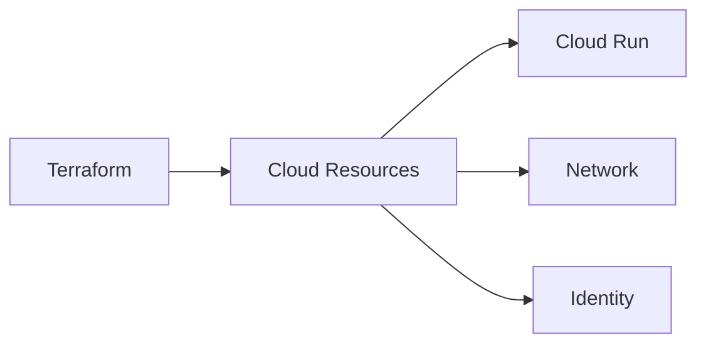
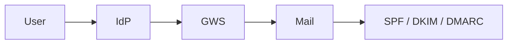
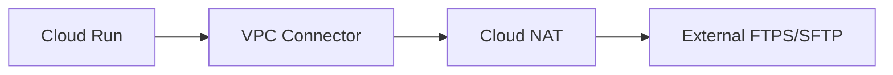

# Cloud Infrastructure & Automation Architect

This repository documents cloud infrastructure designs, automation systems, and operational architectures built to solve real-world engineering problems.

The focus is not on showcasing specific technologies, but on building systems that are:

- Reproducible
- Explainable
- Operable in production environments

The repository contains architecture documentation, implementation examples, and experimental automation systems.

---

# Featured Project

## OpenGemini-Lite  
AI-assisted knowledge automation agent

### Overview

OpenGemini-Lite is an automation pipeline that converts Slack conversations into GitHub assets using AI.

The goal is simple:

> Turn conversations into structured engineering artifacts.

Instead of copying and pasting notes, the system connects Slack, AI processing, and GitHub directly.

---

### Architecture

```mermaid
graph LR
    subgraph UI
        A[Slack]
    end
    
    subgraph Runtime
        B(OpenGemini-Lite / Cloud Run)
    end
    
    subgraph Intelligence
        C[Gemini API]
    end
    
    subgraph Execution
        D[GitHub Actions]
    end

    A --> B
    B --> A
    B <--> C
    B --> D
````

---

### Tech Stack

* Go (Runtime)
* Google Cloud Run
* Gemini API
* GitHub Actions
* Slack Events API

---

### Key Design Points

**Asynchronous processing**

Slack requires responses within 3 seconds.
The system immediately returns `200 OK` while AI processing runs asynchronously using Goroutines.

**Safe data transport**

AI output is Base64 encoded before sending to GitHub Actions to avoid:

* YAML injection issues
* special character corruption

**Model adaptability**

`gemini-flash-latest` is used so the system can automatically follow model upgrades without manual version management.

---

### Architecture Documentation

AI Agent Design
[https://github.com/conti0513/development_public/blob/main/02_ARCHITECTURE/04_IAC_TERRAFORM/Terraform/design_docs/31_AI_AGENT_OPENGEMINI_LITE.md](https://github.com/conti0513/development_public/blob/main/02_ARCHITECTURE/04_IAC_TERRAFORM/Terraform/design_docs/31_AI_AGENT_OPENGEMINI_LITE.md)

---

# ChatOps / JavaScript Automation

Implementation of ChatOps-based operational tooling using Node.js.

### Features

* Slack Bolt SDK application
* Cloud Run deployment architecture
* Slash command driven automation
* BigQuery data processing pipeline

### Data Processing Design

Functional programming patterns are used to maintain safe and readable data transformations.

* `filter`
* `map`
* `find`
* `some`
* `every`

```mermaid
graph TD
    Input[Raw Data] --> |filter/find| Detection[Detection]
    Detection --> |map/spread| Transform[Transformation]
    Transform --> Slack
    Transform --> BigQuery
```

Implementation
[https://github.com/conti0513/development_public/tree/main/03_IMPLEMENTATIONS/05_ENTERPRISE_IT_OPERATIONS/04_SAAS_OPS_REFACTORING](https://github.com/conti0513/development_public/tree/main/03_IMPLEMENTATIONS/05_ENTERPRISE_IT_OPERATIONS/04_SAAS_OPS_REFACTORING)

---

# Infrastructure as Code

Design and implementation of cloud infrastructure managed as code.

### Areas Covered

* Terraform-based infrastructure management
* Cloud Run deployment architectures
* Network and identity integration
* state management and guardrail design

Architecture documentation
[https://github.com/conti0513/development_public/tree/main/02_ARCHITECTURE](https://github.com/conti0513/development_public/tree/main/02_ARCHITECTURE)


```mermaid
graph LR
    IaC[Terraform] --> Cloud[Cloud Resources]
    Cloud --> Run[Cloud Run]
    Cloud --> Net[Network]
    Cloud --> Id[Identity]
```

---

# Security / Identity / Mail

Architecture documentation and operational records for identity and email security systems.

### Topics

* Google Workspace / IdP integration
* SPF / DKIM / DMARC design
* operational verification logs

Identity / SSO
[https://github.com/conti0513/development_public/tree/main/02_ARCHITECTURE/02_IDENTITY_ACCESS/gws-idp](https://github.com/conti0513/development_public/tree/main/02_ARCHITECTURE/02_IDENTITY_ACCESS/gws-idp)

Mail Security
[https://github.com/conti0513/development_public/tree/main/02_ARCHITECTURE/03_SECURITY_MAIL](https://github.com/conti0513/development_public/tree/main/02_ARCHITECTURE/03_SECURITY_MAIL)


```mermaid
graph LR
    User --> IdP
    IdP --> GWS
    GWS --> Mail
    Mail --> Auth[SPF / DKIM / DMARC]
```

---

# Secure File Transfer

Design experiments for external data transfer systems using FTP / SFTP.

### Example Architecture

* Cloud Run
* VPC Connector
* Cloud NAT
* static IP based outbound connections

Serverless FTPS / SFTP
[https://github.com/conti0513/development_public/tree/main/02_ARCHITECTURE/01_PLATFORM_CLOUD/serverless-ftps-api-public](https://github.com/conti0513/development_public/tree/main/02_ARCHITECTURE/01_PLATFORM_CLOUD/serverless-ftps-api-public)


```mermaid
graph LR
    App[Cloud Run] --> VPC[VPC Connector]
    VPC --> NAT[Cloud NAT]
    NAT --> Ext[External FTPS/SFTP]
```

---

# Background

Infrastructure engineer with experience in:

* cloud infrastructure
* network architecture
* identity and access systems
* automation pipelines

This repository organizes real-world system designs and experiments into reusable engineering knowledge.

Current focus areas include:

* Google Cloud Platform
* Terraform infrastructure automation
* identity and security governance
* event-driven automation systems

```

---
