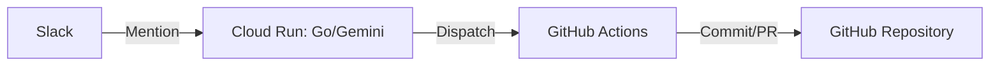

# Tech Inventory

本リポジトリは、
業務上必要となった構成・設計・実装を
**記録として整理したもの**です。

特定の技術スタックやプロダクトを誇示する意図はなく、
再現性・説明可能性・運用性を重視しています。

※ 実験的に、イベント駆動型の自動化基盤についても検証を行っています。

---

## Scope

主に、以下の領域を扱っています。

---

### Infrastructure as Code

クラウド基盤を
コードとして管理するための設計と実装。

* Terraform による構成管理
* Cloud Run / Network / Identity を含む構成
* 設計資料とコードの対応関係を保持

▶︎ Architecture
[https://github.com/conti0513/development_public/tree/main/02_ARCHITECTURE](https://github.com/conti0513/development_public/tree/main/02_ARCHITECTURE)

---

### Security / Identity / Mail

認証・認可・メール基盤まわりの整理。

* Google Workspace / IdP 連携
* SPF / DKIM / DMARC の運用設計
* 検証結果を前提とした記録

▶︎ Identity / SSO
[https://github.com/conti0513/development_public/tree/main/02_ARCHITECTURE/02_IDENTITY_ACCESS/gws-idp](https://github.com/conti0513/development_public/tree/main/02_ARCHITECTURE/02_IDENTITY_ACCESS/gws-idp)

▶︎ Mail / Security
[https://github.com/conti0513/development_public/tree/main/02_ARCHITECTURE/03_SECURITY_MAIL](https://github.com/conti0513/development_public/tree/main/02_ARCHITECTURE/03_SECURITY_MAIL)

---

### Secure File Transfer

FTP / SFTP を含む
ファイル連携基盤の構成検討。

* Cloud Run + VPC Connector + NAT
* 固定IPを前提とした外部連携
* 実運用を想定した分離構成

▶︎ Serverless FTPS / SFTP
[https://github.com/conti0513/development_public/tree/main/02_ARCHITECTURE/01_PLATFORM_CLOUD/serverless-ftps-api-public](https://github.com/conti0513/development_public/tree/main/02_ARCHITECTURE/01_PLATFORM_CLOUD/serverless-ftps-api-public)

---

### Event-Driven AI Agent / OpenGemini-Lite

Slack を起点とし、最新の AI モデルと CI/CD パイプラインを直結させた**自律型イベント駆動基盤**。

* **Gemini 2.0/3.0 Ready**: `gemini-flash-latest` エイリアスを採用し、AIモデルの進化に自動追従するメンテフリーな設計。
* **Cloud Run × Go**: ステートレスかつ低レイテンシな「脳」として、Slack API の制約内で高度な構造化データを錬成。
* **GHA as Muscle**: GitHub Actions を実行レイヤーとし、`repository_dispatch` を通じてインフラ操作から TIL 生成までを完全自動化。
* **疎結合アーキテクチャ**: 思考（AI）と実行（CI）を分離し、将来的なマルチエージェント化や他プラットフォーム連携を容易にする拡張性を確保。

▶︎ AI Agent (OpenGemini-Lite)
[https://github.com/conti0513/development_public/blob/main/02_ARCHITECTURE/04_IAC_TERRAFORM/Terraform/design_docs/31_AI_AGENT_OPENGEMINI_LITE.md](https://github.com/conti0513/development_public/blob/main/02_ARCHITECTURE/04_IAC_TERRAFORM/Terraform/design_docs/31_AI_AGENT_OPENGEMINI_LITE.md)

---

## Background

インフラ／ネットワーク／ID 基盤を中心に業務経験。

現場で必要になったものを整理し、
使える形で残しています。

現在は、エンタープライズ規模の環境に向けた
GCP / Terraform / Identity / セキュリティガバナンス
およびイベント駆動型自動化基盤の設計に注力しています。

---
