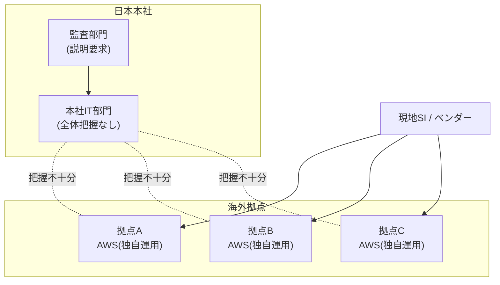

# ケーススタディ：考察

## グローバル拠点で先行導入されたクラウドのガバナンス再整理

（AS-IS分析と課題抽出）

---

## 1. 物語のはじまり（背景）

ある日系メーカーA社。
国内本社は堅実なIT運用を続けてきたが、海外拠点の事業拡大に伴い、
**各国拠点が独自判断でクラウド（AWS）を導入**し始めた。

導入理由は現場としては合理的だった。

* 本社承認を待っていられない
* 現地SIがAWSを前提に提案してきた
* スピード重視の事業要請

結果として、
**「とりあえず動いている」クラウド環境**が複数国・複数部門に存在する状態となった。

---

## 2. 現在の状態（AS-IS）

### 技術面

* AWSアカウントが国・部門単位で乱立
* IAM設計、命名規則、ログ取得方針がバラバラ
* セキュリティ設定は「現地任せ」
* コストの全体把握ができない

### 組織面

* 本社IT部門は全体像を把握できていない
* 海外拠点は「動いているものを止めたくない」
* 監査部門からは説明責任を求められている

### 状態を一言で言うと

> **クラウドはあるが、運用の“主体”が存在しない**

---

## 3. AS-IS構造の俯瞰（現状イメージ）

---

## 4. 表面化している課題（Problem）

* 監査対応時に「誰が責任者か説明できない」
* セキュリティ事故が起きた場合の影響範囲が不明
* コスト増加の理由が説明できない
* 新規クラウド導入案件が毎回ゼロベース議論になる

本社は気づき始める。

> 「これは技術の問題ではなく、
> **統制と運用ルールの問題**だ」

---

## 5. 摩擦が生まれるポイント（Conflict）

### 本社側の主張

* ガバナンスを効かせたい
* 標準化したい
* 説明責任を果たしたい

### 海外拠点側の主張

* スピードを落としたくない
* 日本主導のルールは現実的でない
* すでに投資して動いている

👉 **正義 vs 正義**
どちらも間違っていない。

---

## 6. 整理のアプローチ（Thinking）

重要なのは、

* すべてを統一しない
* すべてを止めない
* しかし「放置」は終わらせる

つまり、

> **「最低限のガードレール」を決める**

---

## 7. 技術的な切り口（AS-IS分析軸）

### ① 監査・証跡（最優先）

* 責任者を説明できるか
* 操作履歴が追えるか
* 監査部門が自力で確認できるか

**→ 壊れていると他はすべて無意味**

---

### ② セキュリティ（責任境界）

* 管理者は誰か
* 本社／海外拠点／SIの権限分離
* 事故時の影響範囲

**→ 技術より境界線**

---

### ③ コスト

* 月次で説明できるか
* 国・用途・事業で分解できるか
* 請求責任の所在

**→ 経営と会話できる唯一の切り口**

---

### ④ 運用の妥当性

* 夜間・休日の対応主体
* 障害時の一次判断
* 例外処理の扱い

**→ ここを壊すと現場が反発**

---

### ⑤ 変更耐性 / CI/CDフレンドリー

* 手作業前提になっていないか
* 属人化していないか
* 将来の標準化余地

**→ 今はやらないが塞がない**

---

## 8. 優先順位（AS-IS視点）

1. **監査・証跡**
2. **セキュリティ（責任境界）**
3. **コスト**
4. **運用の妥当性**
5. **変更耐性 / CI/CD**

---

## 9. 本ケースの位置づけ

これは解決策を出すフェーズではない。

> **言語化されていないAS-ISを、
> 技術と運用の言葉で“見える化”するフェーズ**
