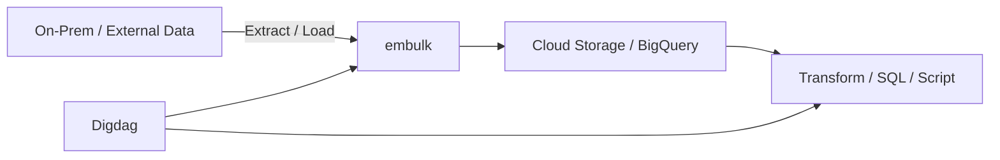

# 技術検討ログ：オンプレ前提 GCPデータ基盤（設計メモ）

## 0. Overview（3行）
オンプレミス上の業務データを起点に、Google Cloud 上でセキュアかつ信頼性の高いデータ基盤を構築・運用する前提を整理する。  
目的は「構築」ではなく「止まらず・壊れず・属人化しない運用が回る」状態の実現。  
本メモは、案件要件の実像（課題・構造・AS-IS/TO-BE・差分）を言語化し、学習/準備の基準点とする。

---

## 1. 想定課題（Problem Statement）
オンプレミス環境に存在する事業データをもとに、Google Cloud 上に **セキュアで信頼性が高く、自動化されたデータ基盤** を構築する。  
単なるデータ格納ではなく、以下を同時に満たすことが求められる。

- 継続運用が可能（運用フェーズを前提）
- 手動作業に依存しない（自動化・再現性）
- 失敗時に検知・復旧できる（再実行性・可観測性）
- 属人化しない（コード/ドキュメントで明文化）

---

## 2. 前提（Constraints / Non-negotiables）
- データの一次生成元はオンプレミス
- 業務データのため停止・欠損が許されない
- セキュリティ・権限分離を初期から設計する
- 手作業運用はスケールしない（自動化前提）
- 責任境界（オンプレ ↔ クラウド）を曖昧にしない

---

## 3. 全体構造（High-level Architecture）
### 3.1 データフロー俯瞰（Mermaid）
```mermaid
flowchart LR
    A[On-Premises Data] -->|Secure Transfer| B[Cloud Storage]
    B --> C[ETL / Workflow]
    C --> D[BigQuery]
    D --> E[Downstream / Analytics]

    subgraph GCP
        B
        C
        D
    end

    C --> F[Monitoring / Alerting]
    D --> F
````

### 3.2 構成要素（役割）

* Cloud Storage：生データ/中間データの置き場、再処理の起点
* ETL / Workflow：取り込み・変換・依存関係管理（定期実行の心臓部）
* BigQuery：加工・集計・分析の中心（コスト/性能設計が重要）
* CI/CD：変更の自動反映（人が手で回さない）
* Monitoring：失敗検知・アラート・再実行判断（運用負荷を下げる）

---

## 4. AS-IS / TO-BE（想定現状と目指す姿）

### 4.1 AS-IS（想定される現状）

* オンプレ側に業務データが存在
* 連携が手動/属人的、または運用が部分的に暗黙知
* 障害時の検知・再実行・原因追跡が弱い
* 環境構築や設定が人依存（再現性が低い）
* 手順書/構成が分散し、運用引継ぎが難しい

### 4.2 TO-BE（目指す姿）

* オンプレ ↔ クラウドの責任境界が明確
* 取り込み〜加工までが自動化されている
* 失敗時に検知でき、再実行・復旧が可能
* 構成・手順がコードとドキュメントで管理されている
* 人が張り付かなくても回る（運用負荷が低い）

---

## 5. 運用前提の設計ポイント（SRE的観点）

* 再実行性：途中失敗しても安全にやり直せる（冪等性、二重取り込み防止）
* 失敗耐性：失敗を前提に、検知・リトライ・保留ができる
* 可観測性：ログ/メトリクス/アラートで状況が追える
* 権限分離：アクセス権、責任範囲、監査を初期設計する
* 明文化：構成・手順・判断基準を文章で残す

---

## 6. 技術要素の整理（用語・役割）

### Ansible

サーバー/実行環境の状態を揃える。手作業の設定差分を減らし、再現性を担保する。

### Jenkins（CI/CD）

ETL定義や構成変更を自動反映する仕組み。人が実行ボタンを押さない前提を作る。

### embulk

データ取り込み（ETL）のためのツール。オンプレや外部ソースからのデータ投入で利用されることがある。

### Digdag

ワークフロー/依存関係を管理し、ジョブをスケジューリングして回す。バッチ運用の制御面を担う。

### BigQuery

分析・集計の中核。SQLで扱えるが、RDBと同じ感覚ではなく、コスト/性能を意識した設計が重要。

### IaC（Infrastructure as Code）

インフラ構成をコードで管理し、再現性・レビュー可能性・属人性排除を実現する考え方/手法。

---

## 7. 自分の技術スタックとの照合（Fit / Gap）

### 7.1 活かせる点（現時点の強み）

* Linux 前提の運用・設計思考
* Docker / IaC / CI/CD の概念理解・実務経験
* オンプレ ↔ クラウドの責任境界を意識した設計
* 監視・改善を前提とした運用視点（SRE文脈）
* 「構築より運用」を重視する設計思想

### 7.2 足りない/弱い点（差分）

* BigQuery 特有の設計・クエリ最適化（実務量）
* ETL/ワークフロー（embulk/Digdag/Airflow等）の本番運用経験
* 冪等性・データ品質・再実行設計の実体験（データ基盤特化領域）
* データ基盤の運用で発生する障害パターンの経験値（回して学ぶ部分）

---

## 8. 位置付け（このメモの結論）

本案件は「今すぐ取る/取らない」の判断材料というより、
データ基盤エンジニア像（運用前提・自動化・可観測性）を具体化するための基準点として扱う。
現時点では、思想・前提理解は到達している一方、データ基盤特化の実務量が差分となる。

---

## 9. 次アクション（実装なし前提の準備）

* 本メモを「差分スキルの棚卸し」として保持（更新して育てる）
* 必要になったタイミングで `projects/` 配下に実装用ディレクトリを新設する
* TILには本メモへのリンクのみ貼る（本文肥大化を避ける）


## 10. 技術用語メモ  
## ETL × BigQuery 学習メモ  
### AS-IS / TO-BE 構造整理（現場ベース）

---

### 1. AS-IS（現状構造）

#### 背景
- ETLという概念設計がないまま、場当たり的に実装が進行
- データ元（POS）のカラム構成が、基幹システム要件を満たしていない
- 手動転送（WinSCP等）を起点とした運用が存在し、構成がスパゲッティ化
- 失敗検知・再実行・責任境界が曖昧な状態で運用が継続

---

#### 現行フロー（AS-IS）

##### データ取り込み〜整形（分析 / Queryエンジニア担当）
- POS（Windows）
  - ローデータ（基幹要件未達）
  - スケジュール実行で GCP コマンドを起動
- GCS（箱1）
  - 生データを一時保管（Raw / Staging）
- BigQuery
  - 要件を満たすようにデータ整形（カラム調整・型補正など）
- GCS（箱2）
  - 整形済みデータを出力（UTF-8）

---

##### 配送・変換（自分が担当）
- GCS（箱2）への PUT をトリガに Cloud Run が発火
- UTF-8 → SJIS へ文字コード変換（Transform）
- ログ・メタ情報を GCS（箱3）へ保存
- セキュアに基幹システムへ転送（SFTP / FTPS）

---

#### AS-IS の課題
- 各工程の責任境界が明文化されていない
- データの正（Source of Truth）が不明確
- 失敗時の再実行・二重送信防止ルールがない
- ログや処理履歴が分散し、追跡性が低い
- ETL全体像を説明できるドキュメントが存在しない

---

### 2. TO-BE（目指す構造）

#### 基本方針
- ETLを「処理の集合」ではなく「運用前提の構造」として再定義
- データの流れを **ゾーン（箱）単位** で分離し、責任境界を明確化
- Transform を段階分離し、役割を整理
- 自動化・再実行・可観測性を前提に設計する

---

#### TO-BE フロー（概念整理）

##### ゾーン定義
- GCS 箱1（Raw / Staging）
  - 原本保管・再処理起点
  - 加工しない、触らない
- BigQuery（Curated）
  - 業務要件を満たす形への整形・正規化
- GCS 箱2（Delivery）
  - 外部連携向け成果物（UTF-8）
- GCS 箱3（Ops）
  - ログ・メタ・再実行情報の集約

---

##### Transform の分離
- Transform①（BigQuery）
  - カラム構成調整
  - 型変換・欠損補完
  - 業務要件への適合
- Transform②（Cloud Run）
  - 文字コード変換（UTF-8 → SJIS）
  - 外部システム制約への適応
  - 配送前の最終加工

---

#### ETL全体構造（TO-BE）

```mermaid
flowchart TB
  subgraph OnPrem
    POS["POS Windows<br/>Raw Data (Not meeting requirements)"]
    SCH["Scheduler<br/>(gcloud command)"]
  end

  subgraph GCP
    GCS1["GCS Box1<br/>Raw / Staging"]
    BQ["BigQuery<br/>Transform-1<br/>Business schema shaping"]
    GCS2["GCS Box2<br/>Delivery (UTF-8)"]
    CR["Cloud Run<br/>Transform-2 + Delivery<br/>UTF-8 to SJIS"]
    GCS3["GCS Box3<br/>Ops<br/>Logs / Meta / Retry"]
  end

  subgraph CoreSystem
    CORE["Core System<br/>(SFTP / FTPS)"]
  end

  POS --> SCH --> GCS1 --> BQ --> GCS2
  GCS2 -->|"PUT trigger"| CR
  CR -->|"log / meta"| GCS3
  CR -->|"secure transfer"| CORE

```

---

### 3. TO-BEで意識する運用設計ポイント

* データ責任境界（SoT）の明確化
* 冪等性（同一データの二重送信防止）
* 失敗時の再実行設計
* ログ・メタ情報の一元管理
* 人手を介さない実行フロー

---

### 4. 学習メモ（BigQueryの位置づけ）

* BigQueryは「分析専用」ではなく **ETLの中核的Transformレイヤー**
* 重要なのは

  * どこまでをBigQueryでやるか
  * どこからを外部処理に切り出すか
* BigQueryはパイプラインの **終点ではなく通過点** になり得る

---

### 5. まとめ（気づき）

ETLの問題は、ツールやSQLの問題ではなく
**構造・責任境界・運用定義が存在しないこと** に起因する。

BigQueryとCloud Runを分離して設計することで、
モダンなクラウドとレガシーな基幹システムを
無理なく接続できる構造が成立する。

---

## embulk / Digdag 学習メモ

### embulk（えんばるく）

ETL（特に Extract / Load）を担う **データ転送・取り込みツール**。
オンプレや外部ソースからデータを取得し、
BigQuery / Cloud Storage へ **定義ベースで再現性をもって投入**する。

#### ポイント

* データ取得と投入に特化
* 設定ファイルで再実行可能
* 手動転送の排除・属人化防止

---

### Digdag（でぃぐだぐ）

ETL全体を **どの順で・いつ・どう回すか** を制御する
ワークフロー（オーケストレーション）ツール。

#### ポイント

* 依存関係・定期実行・失敗制御
* embulkやSQLをまとめて管理
* 夜間/日次バッチの司令塔

---

### embulk × Digdag の関係

* embulk：データを運ぶ
* Digdag：流れを制御する

---

### 配置イメージ



---

## 警報転送（Alert → Slack）設計メモ

### 方針

* 処理はログ出力のみ
* 検知・通知は Cloud Monitoring に集約
* Slack は Notification Channel として利用

---

### 監視構成

1. Cloud Logging
2. ログベースメトリクス
3. Cloud Monitoring Alert Policy
4. Slack Webhook 通知

---

### 監視対象（最小）

* Cloud Run 転送失敗（ERROR / 非200）
* BigQuery ジョブ失敗
* successログ欠損（24h）

---

### メモ

* 処理から直接Slack通知しない（責務分離）
* Opsメタログ（run_id/status等）で監視・監査が安定

