# 基幹業務システムの自社AWS移管・運用近代化計画

## 1. プロジェクトの背景と目的

- **脱ベンダーロックイン**  
  特定ベンダーのAWS環境・保守体制への依存を解消し、不透明なコストを適正化する。

- **資産の主導権回収**  
  数千万円規模の投資がなされたシステムを、自社で100%把握・コントロール可能な  
  「自社資産」へ再定義する。

- **運用の近代化**  
  手動・属人的な運用を、AWSのマネージドサービスによる  
  「自動・可視化された運用」へ転換する。

```mermaid
flowchart TD
  %% ===== AS-IS =====
  subgraph ASIS["【現状】AS-IS（ベンダー依存・ブラックボックス）"]
    direction TB
    B_AWS["ベンダーAWS環境"] --> B_EC2["Windows Server / EC2"]
    B_EC2 --> APP["基幹システム<br/>(IP直書き/手動バックアップ)"]
    B_EC2 --> B_OPS["ベンダー運用<br/>(SSH鍵/DNS/パッチ適用)"]
    B_OPS -.-> COST["不透明な保守費用<br/>(権利のベンダー占有)"]
  end

  %% ===== TO-BE =====
  subgraph TOBE["【理想】TO-BE（自社主導・自動運用）"]
    direction TB
    O_AWS["自社AWS環境"] --> O_EC2["Windows / Linux EC2"]
    O_AWS --> O_SSM["AWS SSM / Patch Manager<br/>(自動パッチ/自動リブート)"]
    O_AWS --> O_BK["AWS Backup<br/>(自動AMI/世代管理)"]
    O_AWS --> O_CW["CloudWatch<br/>(監視/ログ/通知)"]
    O_AWS --> O_INS["Inspector<br/>(脆弱性スキャン)"]

    O_EC2 --> O_SG["Security Group<br/>(外壁による通信制御)"]
    O_EC2 --> O_DNS["Route 53 / DNS / SSL<br/>(TTL短縮・切替/切戻し)"]
    O_EC2 --> O_IAC["GitHub / IaC<br/>(Terraform等で構成の可視化)"]

    O_IAC -.-> VALUE["コスト最適化<br/>(自社資産として管理)"]
  end

  ASIS ==> |"PH1: 権利回収・AMI移行<br/>PH2: 自動化・モダナイズ"| TOBE
```

---

## 2. PH1：自社環境移管（確実な稼働と権利の回収）

基幹システムとして**「止まらないこと」**を最優先とし、  
現行環境をベースとした **ハイブリッド移行戦略** を採用する。

### 2.1 AMIベースの確実な環境再現

- **戦略**  
  クリーン構築の理想を追いつつも、レジストリや特定マイナーバージョンのランタイム等、  
  いわゆる「秘伝の依存関係」を漏らさず再現するため、AMIを使用する。

- **パージ（清掃）**  
  移管直後に以下を徹底的に整理し、環境を健全化する。
  - 不要なベンダーアカウント
  - 古いログ
  - 一時ファイル

### 2.2 ネットワークと疎通の完全再現（最重要）

- **IPアドレス依存の解消**  
  レガシー特有の「IPアドレス直書き」通信を洗い出し、
  - 新環境IPへの置換  
  - または Route 53 を用いたドメイン制御  
  により解決する。

- **Security Groupによる外壁制御**  
  基幹システム本体には手を加えず（**鎮座**）、  
  AWSインフラ層で必要最小限のポートのみを許可する  
  **ホワイトリスト運用**を徹底する。

### 2.3 主導権の回収

- **DNS / SSL**  
  TTLを事前に **300秒** に短縮し、迅速な切り替え・切り戻しを可能にする。

- **SSH / 認証**  
  AWS Systems Manager（SSM）を活用し、  
  移管直後に認証情報を **自社専用にリセット** する。

---

## 3. Windowsサーバーの自動運用設計

設計思想は **「手動作業の排除」** と  
**「アプリ内スケジュールとの共存」**。

### 3.1 更新管理（Patch & Reboot）

- **SSM Patch Manager**  
  アプリ内の実行スケジュールと競合しない時間帯を  
  メンテナンスウィンドウとして定義し、
  - パッチ適用
  - 再起動  
  までを **全自動化** する。

### 3.2 監視とセキュリティ

- **Amazon CloudWatch**
  - 外形監視（死活監視）
  - OSイベントログの収集  
  異常検知時は **即座にSlack通知**。

- **Amazon Inspector**  
  OSおよびミドルウェアの脆弱性を継続的にスキャンし、  
  セキュリティリスクを可視化する。

### 3.3 バックアップと可用性（正副構成）

- **AWS Backup**
  - 毎日1回
  - AMIによるフルバックアップ
  - 世代管理を自動化

- **擬似正副構成**
  高額な常時2台稼働（Active-Standby）は採用せず、  
  最新AMIから **15分以内に復旧可能** な構成とすることで、  
  **コストと可用性の最適解**を実現する。

---

## 4. PH2：近代化（モダナイズ）ロードマップ

PH1で安定稼働を確立した後、  
さらなる **コスト削減** と **ポータビリティ向上** を目指す。

### 4.1 OS依存のリファクタリング

- 将来的な **Linux（Ubuntu / nginx）化** を見据え、
  - パス区切り文字
  - フォント依存  
  といったOS依存要素を排除する。

### 4.2 IaC化（Infrastructure as Code）

- Terraform 等を用いてサーバー構成をコード化。
- AMIの中身が再び **ブラックボックス化** することを防止する。

### 4.3 GitHubによるバージョン管理

- ツール内定義ファイルを XML 等でエクスポートし履歴管理。
- Java開発の知見を活かした  
  **レビュー前提の近代的運用体制** を確立する。

---

## エンジニアとしての「こだわり」ポイント

> Redmine移行で、  
> **「OSは立ち上がるのに、依存関係の微差でデータ連携が死ぬ」**  
> という地獄を経験しました。  
>
> だからこそ今回は、AMIという **「今の正解」** をベースにしつつ、  
> 外側のネットワーク（DNS / Security Group / IP）を徹底的に設計することで、  
> 基幹システムの **安全な内製化** を完遂させます。
