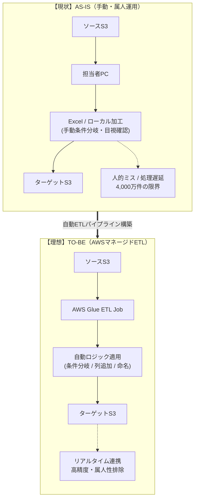

# データ加工・連携の自動化  
## サーバーレスETLパイプライン設計（AWS Glue）

---

## 1. 現状の課題（AS-IS）

- **全工程が手動**
  - S3からのダウンロード
  - Excel／ローカルスクリプトによる加工
  - 別S3バケットへのアップロード  
  → 人力・属人手順に依存

- **データ量の限界**
  - 約4,000万件規模のデータを手動処理
  - 処理時間の増大、条件分岐漏れなどの加工ミスが発生

- **非リアルタイム**
  - 人を介するため、同期に数日〜数週間のタイムラグ
  - 意思決定のスピードを阻害

---

## 2. 解決策（TO-BE）：AWS Glueによる自動ETL

大規模データに耐え、**人を介さないデータ連携**を実現する。

### 2.1 マネージドETL（AWS Glue）の採用

- 約4,000万件のデータボリュームを前提に設計
- Lambdaの
  - 実行時間制限（15分）
  - メモリ制約  
  を回避し、分散処理で確実に完遂

### 2.2 ロジックのプログラム化

- 手作業で行われていた以下を **コード化**
  - 条件分岐（IF）
  - 列追加
  - ファイル命名規則
- Python（PySpark）で実装し、
  - Java開発で培ったロジック設計
  - テストによる検証  
  をETLに持ち込む

### 2.3 完全自動トリガー

- S3イベント検知による自動実行  
  または
- スケジュール実行（定時バッチ）

→ **人間が介在しないクリーンなパイプライン**

---

## 3. AS-IS / TO-BE 構成図

