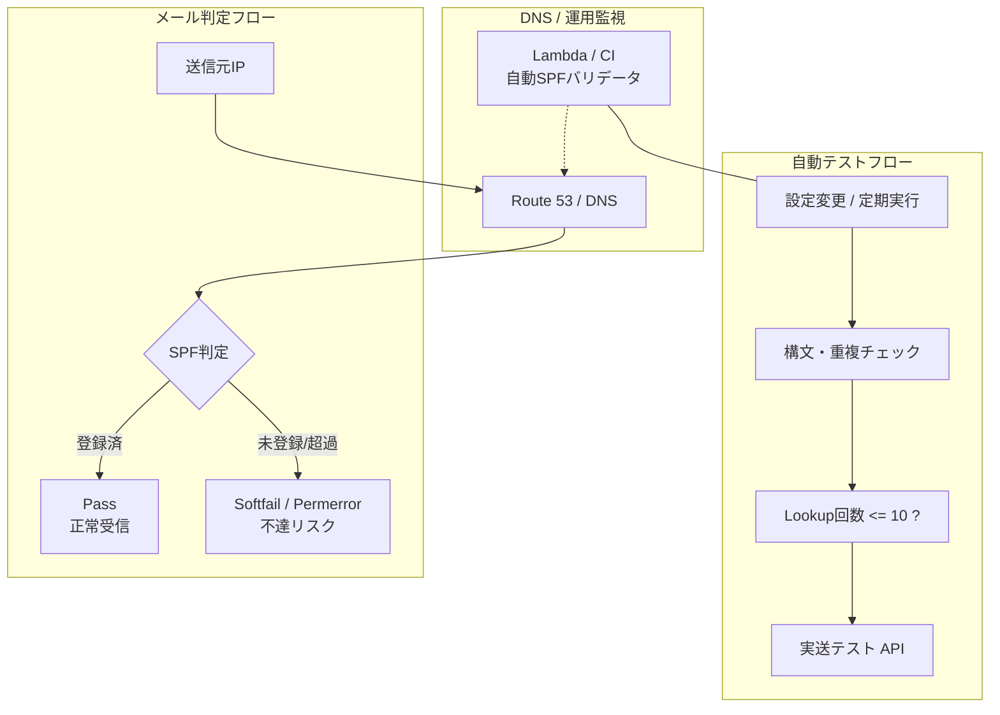
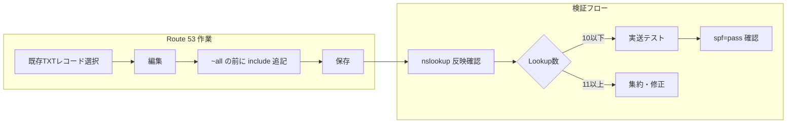

# SPFの運用と自動化

## メールフロー視点での設計（Pass / Softfail / Fail）

---

## 1. SPF運用の技術論点（チェックリスト）

* **DNS Lookup 制限（10回ルール）**

  * `include` / `a` / `mx` などの参照は **合計10回まで**
  * 超過すると **Permerror** となり、不達の直接原因になる

* **集約の原則**

  * 1ドメイン＝1 SPFレコード
  * 追加時は新規作成せず、既存レコードの
    **`~all` / `-all` の直前に追記**

* **メールフロー上の判定**

  * **Pass**：送信元IPがSPFに含まれている（正常受信）
  * **Softfail（`~all`）**：未登録IPだが受信は許可（迷惑メール判定リスク）
  * **Fail（`-all`）**：未登録IPは受信拒否（誤設定時の影響が大）

* **構文ルール**

  * `v=spf1` で開始
  * 255文字制限
  * 長文化する場合は **二重引用符で分割管理**

---

## 2. SPF自動検証アーキテクチャ（TO-BE）

手動チェックから
**「継続的バリデーション」** への進化を可視化する。

---

## 3. 自動化案（要点まとめ）

### 3.1 静的解析（CI）

* GitHub Actions 等で自動検証

  * SPF構文の正当性
  * DNS Lookup 回数
* 制限超過・構文エラー時は **ビルドエラーで即検知**

### 3.2 動的監視（Lambda）

* `dig` / `nslookup` を定期実行
* 現在のDNSレコードと
  **期待値（Golden Record）** を比較
* 差分検知時にアラート通知

### 3.3 実疎通テスト

* Mail-tester 等のAPIを利用
* 実送信により

  * SPFが **Pass** になるか
  * 想定外の判定が出ていないか
    を定期的に検証

---

## 4. Route 53 で「実際になにを書くか」

やることは
**「既存TXTレコード（SPF）の編集」1箇所のみ**。

### レコード修正ルール（重要）

| 状態  | 記述例                                                             | 解説                |
| --- | --------------------------------------------------------------- | ----------------- |
| 修正前 | `"v=spf1 include:_spf.google.com ~all"`                         | Googleのみ許可        |
| 修正後 | `"v=spf1 include:_spf.google.com include:new-service.com ~all"` | **`~all` の直前に追記** |

**注意点**

* TXTレコードを **2つに分けない**
* Route 53 では値全体を **ダブルクォーテーションで囲む**

---

## 5. 作業後に行うテスト（3段階）

1. **反映確認**

   * `nslookup -type=TXT ドメイン名`

2. **Lookup回数チェック**

   * dmarcian 等で **Total DNS lookups ≤ 10** を確認

3. **実送テスト**

   * 実際に送信し、受信ヘッダで **`spf=pass`** を確認

---

## 6. SPF運用フロー（横並び・整理版）

※ 最後の図を **縦→横フロー** に修正

---

## 7. ビジネス・運用への説明テンプレ

* **なぜ慎重なのか**

  * 「SPFは10回制限があり、超えると **全社メール不達** という致命的事故になる」

* **なぜ自動化するのか**

  * 「誰が作業しても、**追記した瞬間に危険を検知できる仕組み**にするため」

---

