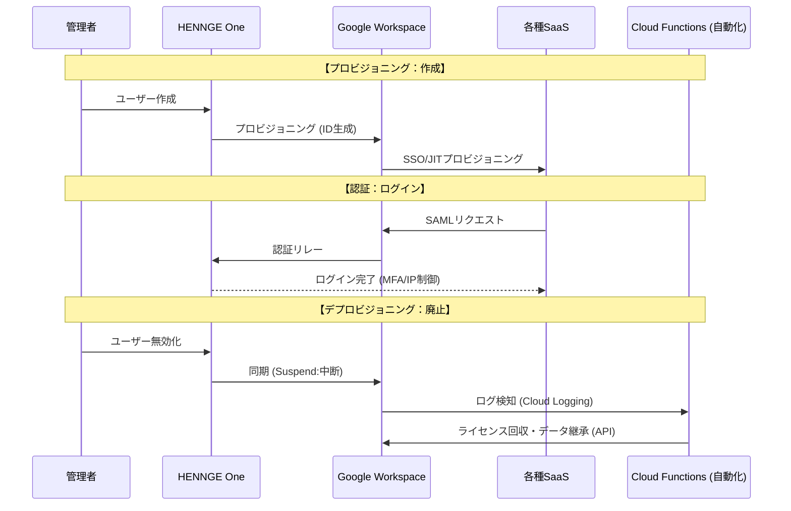

# 📋 GWS移行・ID基盤統合設計書（マスター版）
## 〜移行フェーズ／OT／運用自動化〜

## 1. 構成概要 (ASIS ➡ TOBE)

* **IDマスター:** HENNGE One（起点）
* **認証・基盤:** Google Workspace (Cloud Identity)
* **連携方式:** SAML/OIDCによるSaaS一括SSO
* **自動化:** Cloud Functions (CF) 等によるライフサイクル管理

---

## 2. 移行フェーズと「設計者」の勘所

| フェーズ | 主要タスク | 成功のためのポイント (ACE視点) |
| --- | --- | --- |
| **準備** | 現状棚卸し・ドメイン検証 | TTLを事前に短縮（300s）。ドメイン所有権証明。 |
| **構築** | 二重配信 (Dual Delivery) | レガシーとGWS両方に届く期間を設け、消失を防ぐ。 |
| **移行** | Google Workspace データ移行サービス / IMAP移行 | 移行ログをCloud Loggingで監視しエラー率を分析。 |
| **切替** | MXレコード変更 | SPF/DKIMの並行運用設定を完遂させる。 |

---

## 3. テスト手順書 (運用・受入テスト：OT)

「ドメインを本番に差し替えるだけ」で動くことを最小構成で証明します。

### ① 正常系：プロビジョニング＆SSO

1. **HENNGE有効化:** GWS側に「アクティブ」でユーザーが作成されるか。
2. **SSOログイン:** アプリランチャーからSaaSへパスワードレスで入れるか。
3. **属性連携:** 氏名・メアドがSaaS側プロフィールに反映されているか。

### ② 正常系：メール配送（二重配信）

1. **外部受信:** 外部から本番宛に送り、新旧両方のトレイに届くか。
2. **外部送信:** GWSから送り、受信側でSPF/DKIMが「PASS」しているか。

### ③ 異常系：廃止・遮断（キルスイッチ）

1. **IDロック:** HENNGEで停止し、GWS/SaaSへのログインが即座に拒否されるか。
2. **バイパス防止:** GWSの直ログイン画面から入ろうとして拒否されるか。
3. **自動化検知:** Cloud Loggingが中断ログを検知し、CFが正常に動作するか。

---

## 4. 運用・自動化の設計指針

* **役割分担:**
* **HENNGE:** 「入り口と出口」の管理（作成・停止）。
* **GWS:** 「中の椅子並べ」の管理（OU移動、ライセンス、共有ドライブ）。

* **ゾンビアカウント対策:**
* HENNGEでの削除を「Suspend（中断）」でGWSに同期。
* **CF/CRによる自動化:** 中断ログをトリガーに、ライセンス回収とデータ譲渡（オーナー変更）をAPI経由で実行。

* **証跡管理:**
* すべての操作をCloud Loggingに集約し、BigQuery等へ長期エクスポートする設計。

---

## 🛡️ 設計者としてのまとめ

この設計の核心は、**「手作業を減らし、コードとロジックでガバナンスを担保すること」**にあります。ドメインの切り替えは単なる「名前の書き換え」であり、裏側の強固な認証・自動化基盤こそが、将来にわたって汎用的に価値を提供し続ける資産となります。

---
