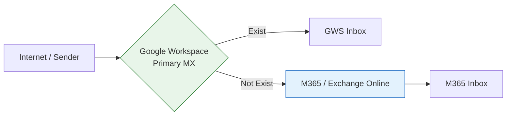
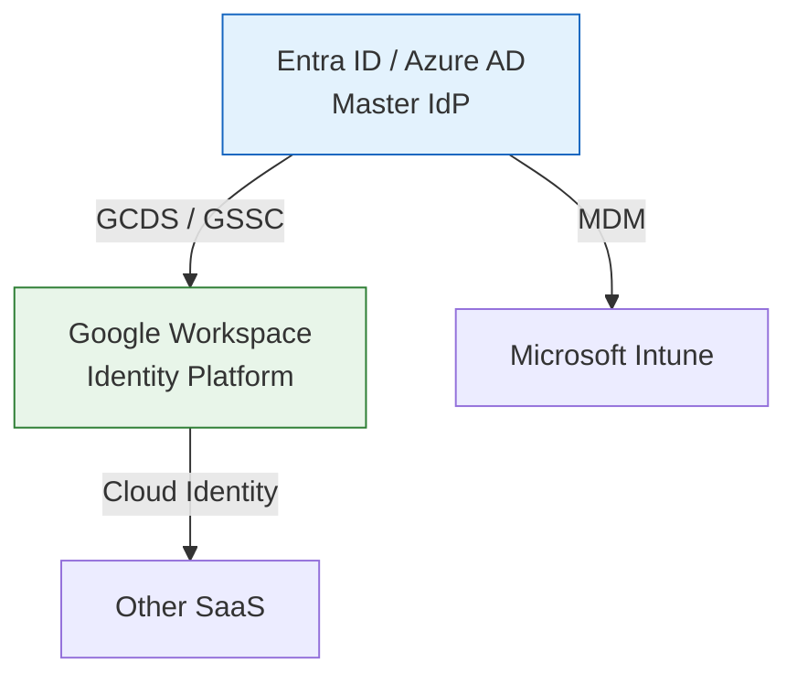

# M365 to Google Workspace Migration: Strategic Points

### 📌 概要

Microsoft 365からGoogle Workspace（以下GWS）への移行プロジェクトにおける、技術的・運用的な主要論点と解決策の定義。単なるデータ移送ではなく、ID基盤の整合性とビジネス継続性を最優先としたアーキテクチャ。

---

### 1. 共存期間のメールルーティング (Coexistence)

移行期間中のメール不達を防ぐ「スプリット・デリバリ」構成。

* **論点:** どちらの環境にメールが届いても欠落させない設計。
* **解:** MXレコードをGWSに向け、GWS側に「受信トレイにないユーザーへの転送（スプリット・デリバリ）」を設定。M365側にはエイリアスドメイン（`.onmicrosoft.com`等）をルーティング先として指定。
* **Action:** 移行1ヶ月前からGWSへの「サイレント全転送」を開始し、切り替え当日のデータ差分を最小化する。

---

### 2. ID基盤と認証 (Identity Management)

Entra IDをマスターとしたディレクトリ同期の維持。

* **論点:** 既存のWindows端末管理（Intune）やSSO環境を壊さずにGWSを導入する。
* **解:** **Entra IDをマスター（IdP）**として維持。**Google Cloud Directory Sync (GCDS)** によりユーザー・パスワードハッシュをGWSへ単方向同期。
* **Action:** 移行後の二重管理を避けるため、Google側のデバイス管理は「基本（エージェントレス）」に設定し、Intuneとの競合を回避。

---

### 3. データ移行の構造化 (Data Migration)

SharePointから共有ドライブへのマッピングと整合性。

* **論点:** SharePointの階層構造（継承モデル）とGoogleドライブ（共有モデル）の非互換。
* **解:** **Google Workspace Migrate (GWM)** を採用。
* 3階層以上の深いネストはフラット化。
* 文字数制限や禁止文字は、移行前にPythonスクリプト等でサニタイズ（事前整地）。

* **Action:** 全データ移行ではなく「直近3年」などの足切りラインを策定。巨大なアーカイブはコールドストレージへの退避を提案。

---

### 4. 責任境界の定義 (Demarcation)

PMOによる「現場を止めない」ためのガードレール。

* **ベンダー担当 (Work):** 移行サーバー（GWM等）の構築、移行バッチの実行、エラーログの解消。
* **自社/PMO担当 (Decision):** 移行スケジュール策定、各部署との合意形成、Go/No-Go判断、例外的なデータ権限の再設計。
* **解:** 「技術実行（ベンダー）」と「ビジネス意思決定・整地（PMO）」を分離し、ベンダーが作業に専念できる環境を作る。

---

### 5. 文化転換のチェンジマネジメント (Change Management)

「不便さ」を「仕組み」でカバーする戦略。

* **論点:** ExcelマクロやTeamsに依存したワークフローの救済。
* **解:** * **GAS/AppSheetの活用:** 業務に不可欠なExcelマクロを特定し、スプレッドシート/GASへの移植可能性を早期検証。
* **逆引きWikiの整備:** 「Outlookのこの機能はGmailのこれ」といった、構造化されたドキュメントの提供。

* **Action:** 各部署に「Googleチャンピオン（パワーユーザー）」を配置し、情シスの負荷を分散させつつボトムアップでの浸透を図る。

---

### 💡 影武者の視点 (Expert Insight)

「大規模移行の成否は、当日の作業ではなく、**『事前のディレクトリ整地』と『共存期間のルーティング設計』**で8割決まります。私は技術的な不整合を論理的に切り分け、ベンダーが動くための『正しい道』を整備します。」

---
