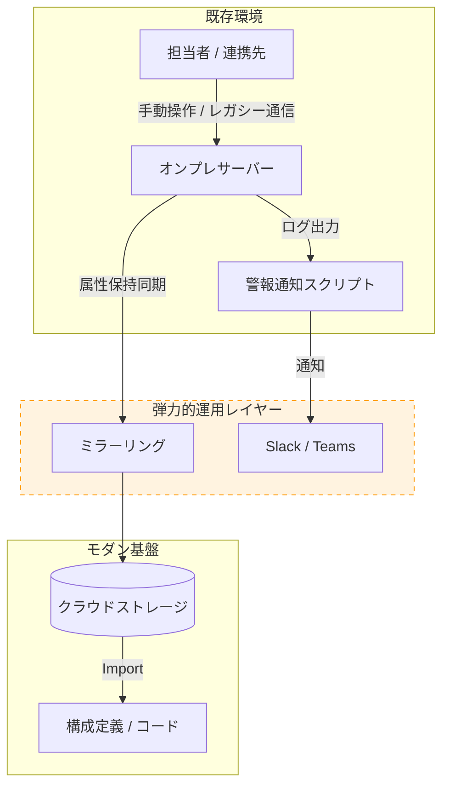

# Case Study 02: Legacy to Modernization with Resilient Ops

### 〜現場の負荷を最小化し、既存環境を段階的に近代化する〜

### 📌 1. 現状の課題（レガシー環境の特性）

1. **システムのブラックボックス化:** 大規模かつモノリスな構成により、一足飛びの移行が困難。
2. **手動運用の常態化:** ファイル配置等の手動操作が業務の核となっており、属人化とミス防止が課題。
3. **プロトコルの制約:** 連携先が従来の通信方式（SFTP/FTPS等）に限定され、最新のAPI連携が困難。
4. **リソースの枯渇:** 日々の保守・障害対応に追われ、改善や技術習得に割く工数が確保できない。
5. **観測性の欠如:** 監視基盤が未整備であり、異常検知が外部からの申告に依存している。

---

### 🚀 2. 解決アプローチ：運用の弾力化（Resilient Ops）

既存のフローを維持しながら、並行して近代化を進める4つのステップ。

#### **① 既存フローを阻害しない「自動化」の導入**

現行の踏み台サーバー等に、属性（タイムスタンプ等）を維持したままクラウドストレージへ同期する仕組みを配置。現場の操作手順を変えることなく、データの冗長化とクラウド化をバックグラウンドで完了させる。

#### **② GUIとIaCの段階的な共存（Drift Management）**

現場でのGUI操作を許容しつつ、構成の差異を定期的にコード側へ取り込む「追従型」の運用を構築。自由度を保ちながら、常に最新の設定をコードとしてバックアップ（再現性を確保）する。

#### **③ 既存資産を活かした「観測性」の向上**

既存のシステムログを監視し、異常をチャットツール等へ即座に通知する軽量な仕組みを導入。システム全体を改修することなく、障害対応のリードタイムを短縮する。

#### **④ 運用の余白創出による好循環**

手作業の自動化により浮いた時間を、次の改善フェーズ（アーキテクチャの再定義等）へ充当。現場の自走力を段階的に高めていく。

---

### 🏗️ 3. 概念図（ハイブリッド運用モデル）

---

### 💎 4. 客観的視点：プロジェクトへの参画意義とコスト価値

本アプローチにおける最大の価値は、リソースが限定的な現場において「既存運用の維持」と「基盤の近代化」を静かに両立させる点にある。

* **「非侵襲的」な基盤改善**
現場の学習コストや心理的ハードルに配慮し、慣習化された操作フローを尊重しつつ、裏側で構成のコード化を並行させる。現場に負荷をかけない設計により、基盤の信頼性を着実に底上げする。
* **実務と構造化の同時並行**
重厚な設計工程を挟む外部委託とは異なり、実務を担いながらその場で自動化・仕組み化を完結させる。最小限のコスト構造で、実体のある「動く環境」を迅速に実装するスタイルを特徴とする。
* **持続可能な環境の整地**
インフラの深い洞察により、複雑化した環境の因果関係を解明する。監視の先手化やプロセスの透明化を通じて、将来的に自走可能な「整えられた状態」を組織に残す。

#### **外部ベンダー起用との比較メリット**

外部ベンダーへの委託で発生しがちな「要件定義・設計の固定費」や「専用ツールの導入コスト」を抑え、実務担当としての配置（人件費）と既存インフラの維持費のみで環境改善を推進する。書類上の納品物ではなく、現場に根付く「自動化された仕組み」を直接構築するため、投資対効果（ROI）が極めて高い。

**結論**
理想論を説く立場ではなく、現場の制約を理解した上で、技術的に最適な解を実装する「実務型の参謀」といえる。限られたリソースの中で、レガシーな環境を低リスクかつ着実に近代化させる際に、その真価が発揮される。

---
