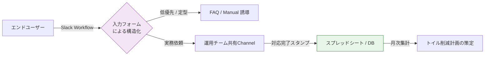

# Case Study 03: SRE Entryway - Breaking the Toil Cycle

### 〜Slackを「防波堤」に変え、既存資産だけでエンジニアの時間を奪い返す〜

### 📌 1. 現状の課題（リテール・サービス現場のリアル）

1. **Slack DMによる「割り込み」の常態化:** 個人への直接依頼により、チーム内で負荷が共有されず、重要なタスクが寸断される。
2. **流量制限の欠如:** 「今すぐ見て」という声の大きさに優先度が支配され、本来のシステム改善工数が奪われている。
3. **トイル（後述）の埋没:** 誰が何に時間を溶かしたか客観的データがないため、人員補充やツール導入の根拠を示せない。
4. **管理コストの回避:** 専用ツールの導入や入力を嫌い、結果として「感覚」による運用から脱却できない。

---

### 🚀 2. 解決アプローチ：Slackハブによる「整地」の3ステップ

#### **① Slack ワークフローによる「入り口の構造化」**

* **解:** 指定チャネルの入力欄に「依頼フォーム」を設置。DMでの依頼を原則禁止し、フォーム経由のみを正規の受付とする。
* **効果:** 受付時点で情報が構造化（件名、対象、緊急度）されるため、ヒアリングの往復工数が激減する。

#### **② 完了スタンプによる「トイルの自動集計」**

* **解:** 依頼への対応完了時に、特定のリアクション（✅スタンプ等）を付ける運用を徹底。
* **効果:** 標準機能やGAS等を用い、スタンプ数を「対応件数・時間」として自動集計。追加コストなしで「何に時間を奪われているか」を可視化する。

#### **③ セルフサービス導線による「ゼロ次回答」の実装**

* **解:** ワークフローの完了画面やBotの自動返信で、FAQやマニュアルのURLを提示。
* **効果:** エンジニアが手を動かす前にユーザーの自己解決を促し、低優先度の依頼がチームに届く前にフィルタリングする。

---

### 🏗️ 3. 概念図（Slack防波堤モデル）

---

### 💎 4. 客観的視点：参画による「運用の弾力化」とコスト価値

本アプローチは、新たな投資を行わず、既存のコミュニケーション環境を「整地」することで組織の生産性を回復させる。

* **「親切心」による弊害の構造的解決**
担当者の善意に依存した「何でも即対応」を、ルール化された「優先順位に基づく対応」へと転換。エンジニアが本来の専門性を発揮すべき業務に集中できる環境を再構築する。
* **コストゼロでの「データ駆動型運用」の開始**
追加のライセンス費用をかけず、既存のSlackと標準機能だけで「工数の可視化」を実現。経営層がリソース配分を判断するための客観的なエビデンスを創出する。

**結論**
「親切な対応」がトイルに化け、1日が磨り減っていく現場を、データの力で「信頼性を守る組織」へと整える。これが、現場の心理を理解した上での実戦的SREエントリーモデルである。

---

### 📝 注釈：トイル（Toil）とは

本資料における**「トイル」**とは、SRE（Site Reliability Engineering）における概念で、以下のような**「付加価値を生まない雑務」**を指します。

* **手作業である:** 自動化されておらず、人間がその都度ポチポチと操作する必要があるもの。
* **繰り返される:** 1回限りではなく、毎日・毎週のように発生するもの。
* **自動化が可能:** 手順が決まっており、本来はスクリプト等で代替できるもの。
* **場当たり的:** その場のトラブルは解決するが、システム自体が根本的に良くなるわけではないもの。

これら「トイル」を削減し、浮いた時間を「本来やるべき改善業務（整地）」に充てることこそが、エンジニアリングの真の目的です。

---
