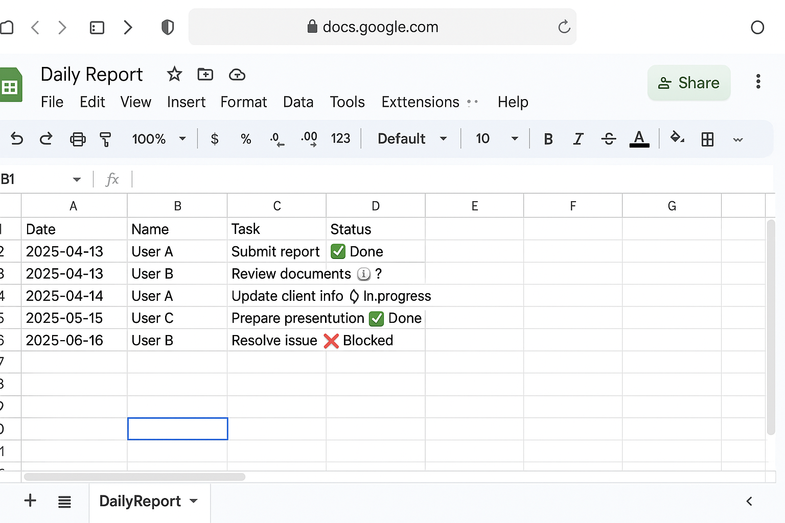
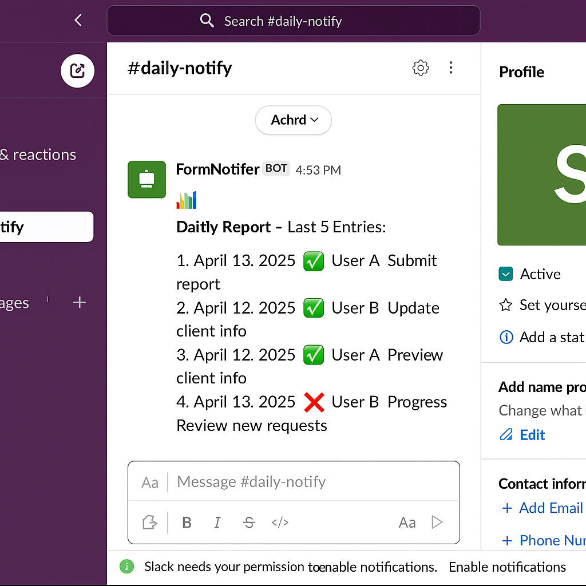

## ✅ `README.md` for `daily-sheet-to-slack`（共有・公開用）

```markdown
# 📊 Daily Sheet → Slack Notifier (GAS)

This Google Apps Script project automatically posts the **latest rows** from a Google Spreadsheet to a **Slack channel** at a scheduled time.

Ideal for:
- 📝 Daily task or incident sharing
- ✅ Lightweight team reporting
- 🧑‍💻 No server needed, just GAS + Slack Webhook

---

## ✅ Features

- ⏰ Scheduled daily Slack notifications (e.g., 09:00 JST)
- 📄 Automatically sends the last N rows from a specific sheet
- 🔒 Slack Incoming Webhook based (no token or app installation required)
- 🛠 Easy configuration via Script Properties

---

## 🧩 Example Inputs & Outputs

### 🔹 Google Sheet (Input)

The script reads the latest N rows from the sheet:



---

### 🔹 Slack Notification (Output)

Resulting message posted to Slack:



---

## ⚙️ Setup Guide

### 1. 📁 Project Structure

```
daily-sheet-to-slack/
├── main.gs                # GAS main script
├── README.md              # This guide
└── assets/                # Screenshots and visual examples
```

---

### 2. 🧑‍💻 Script Properties Setup

In the Apps Script editor:
- Go to: `File` → `Project properties` → `Script properties`
- Add these keys:

| Key | Example Value | Description |
|-----|---------------|-------------|
| `SHEET_ID` | `xxxxxxxxxxxxxxxxxxxx` | Your spreadsheet ID |
| `SHEET_NAME` | `DailyReport` | The name of the tab |
| `ROW_LIMIT` | `5` | Number of rows to send |
| `SLACK_WEBHOOK_URL` | `https://hooks.slack.com/services/XXX/YYY/ZZZ` | Slack Incoming Webhook URL |

---

### 3. 🧠 Script Entry Point

Paste the contents of `main.gs`.  
Example function:

```javascript
function sendDailyUpdate() {
  // Fetch rows & send message (see main.gs for full code)
}
```

---

### 4. 🔁 Set Daily Trigger

- Open Apps Script editor
- Click the "clock" icon (⏰) → Triggers
- Add:
  - Function: `sendDailyUpdate`
  - Source: `Time-driven`
  - Type: `Day timer` → `9:00 AM` (or any time)

---

## 💬 Example Slack Message

```
📊 Daily Report – Last 5 Entries:
1. [2025-04-13] User A | Submit report | ✅ Done
2. [2025-04-13] User B | Review documents | ℹ️
3. [2025-04-14] User A | Update client info | 🕒 In progress
...
```

---

## 📄 License

MIT License  
Feel free to fork, improve, and share this script!

---

## 🙌 Author

Developed by [@conti0513](https://github.com/conti0513)  
Feel free to open issues or PRs!
```

---
