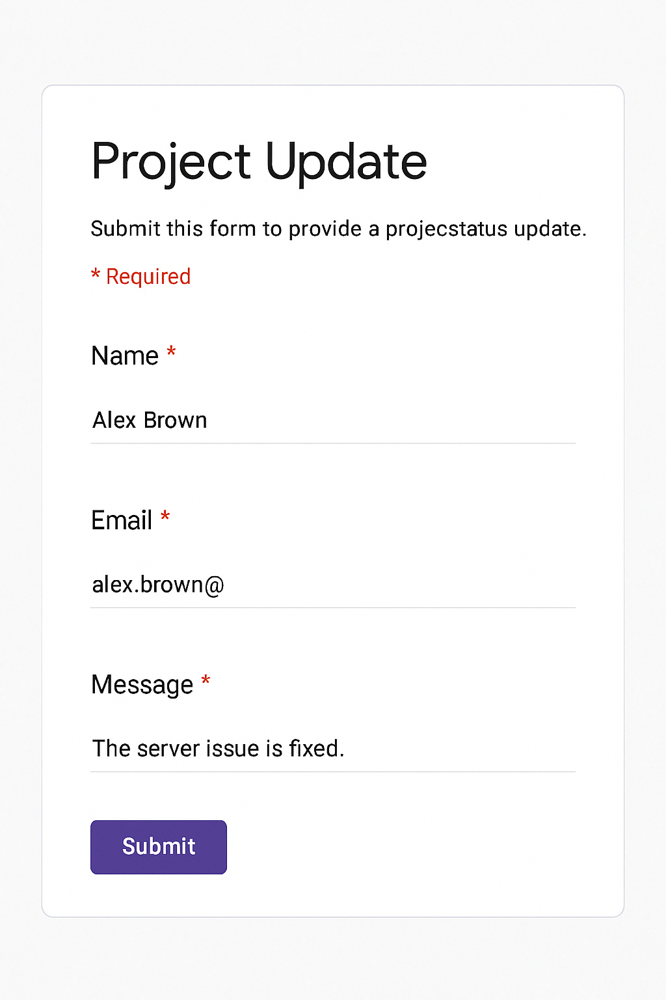
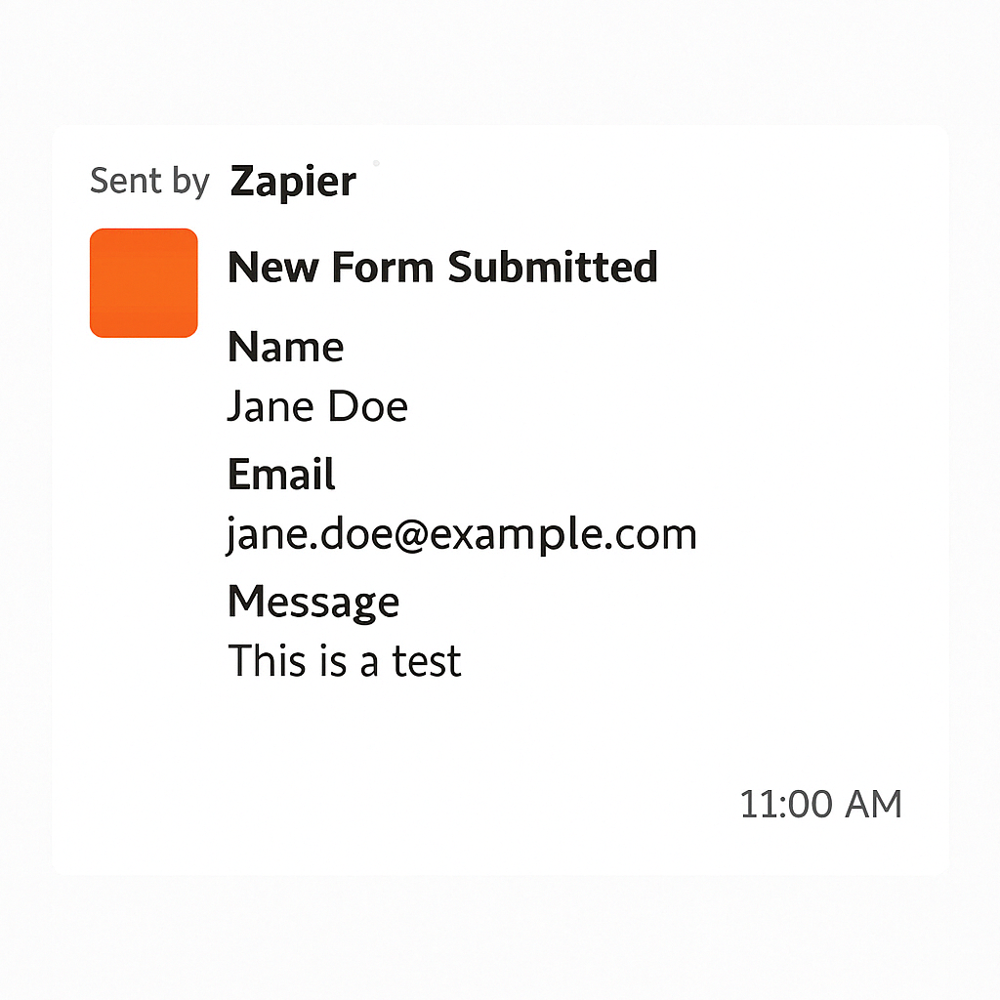

## ✅ 共有用 `README.md`（例：zapier_form_notify_logger/README.md）

```markdown
# 📬 Zapier Form → Slack Notifier

This automation notifies a Slack channel whenever someone submits a Google Form.

---

## ✅ Use Case

- 📩 Contact / Inquiry forms  
- 🧑‍💼 Internal request forms  
- 📋 Project reports or feedback submission  

No coding required — 100% configured via Zapier.

---

## 🛠 Architecture

```
Google Forms → Zapier → Slack
```

- **Trigger:** New Google Form submission
- **Action:** Send message to a specific Slack channel

---

## 🧩 Zap Settings

| Step | App | Action |
|------|-----|--------|
| 1 | Google Forms | New Form Response |
| 2 | Slack | Send Channel Message |

### Message Format (example):

```plaintext
📩 New Form Submitted!

👤 Name: {{Your Name}}  
📧 Email: {{Email Address}}  
📝 Message:  
{{Message or Request Details}}
```

---

## 📷 Screenshots

### ✅ Form Input


### ✅ Slack Notification Example


---

## 📌 Notes

- Zap is deployed under the project: `GoogleForm to Slack`
- Only trusted domain emails are allowed for form submissions
- Messages are sent using the `Zapier` bot

---

## 📄 License

MIT — Feel free to fork, clone, and use!

---

Created by `@conti0513`
```

---

## ✅ スクショ格納例（共通）

```
zapier_form_notify_logger/
├── README.md
├── docs/
│   ├── google_form_sample.png
│   └── slack_notification_example.png
```
