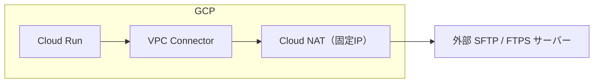
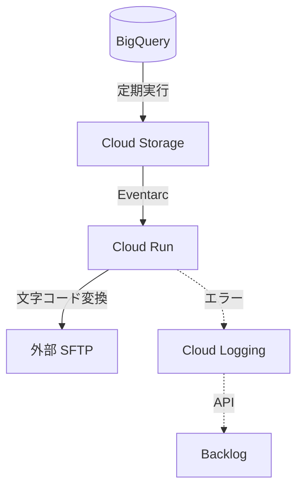

# 業務で実装したクラウド構成例（GCP / IaC）

## 概要

本リポジトリは、**実業務で実装・検証したクラウド構成例の整理**です。
サーバーレス環境において、疎結合性と運用上の安定性を両立することを目的とし、
**現場の制約下でどのような構成を選択したか**を記録しています。

設計思想や理想論ではなく、
「当時の要件・制約の中で実際に採用した構成」を as-is でまとめています。

---

## パターン01：外部レガシー環境（SFTP / FTPS）連携

Cloud Run から、外部の SFTP / FTPS 環境へ接続するための構成例です。
送信元IPの固定や、認証情報の管理が求められる業務要件を前提としています。

### 背景・課題

* サーバーレス環境（Cloud Run）から外部サーバーへ接続する必要があった
* 接続元IPの固定が必須
* 秘密鍵や認証情報をアプリケーションに直接持たせたくない
* 障害時に再実行・切り戻しを容易にしたい

### 採用した構成

* **Cloud Run + VPC Connector + Cloud NAT**

  * Cloud Run の通信を VPC 経由にし、Cloud NAT により送信元IPを固定
* **SFTP クライアント（Go）**

  * 軽量な処理のみを担当させ、状態を持たない構成
* **認証情報の取り扱い**

  * 秘密鍵をコードやコンテナイメージに含めない構成とした

### 運用面での工夫

* **IaC（Terraform）対応**

  * 個人検証環境にて全リソースを Terraform 化
  * 必要に応じてコード管理へ移行可能な状態を維持
* **設定値の分離**

  * 接続先パスやユーザーIDなどの可変情報は JSON で外出し
  * 環境変更時は設定修正と再デプロイのみで対応可能

---

## パターン02：イベント駆動型データ連携（変換・配送）

Cloud Storage を起点に、データ加工と外部配送を行う構成例です。

### 処理フロー

1. **データ抽出**
   BigQuery から定期的にデータを出力
2. **イベント検知**
   GCS へのファイル格納を Eventarc で検知し、Cloud Run を起動
3. **加工処理**
   Go / Python にて文字コード変換（SJIS 対応等）を実施
4. **配送**
   完成したファイルを外部 SFTP サーバーへ転送

### 構成上のポイント

* **冪等性の確保**

  * 処理途中で失敗しても、ファイルを再配置することで再実行可能
* **ステートレス設計**

  * 処理状態をアプリ内に保持しないため、再デプロイのみで復旧可能
* **ログの統一**

  * OS層・アプリ層で共通フォーマットのログ出力を行い、調査性を確保
* **エラー時の対応**

  * Cloud Logging を起点に、エラー内容と再実行手順を記載したチケットを自動起票

---

## 実装・運用における共通方針

* **CLIベース運用**

  * すべてコマンドラインから再現可能な手順を前提
* **認証情報の最小化**

  * 鍵や資格情報を極力持たせない構成を採用
* **復旧容易性の重視**

  * 再デプロイや再実行で復旧できる構成とし、運用負荷を抑制

---
