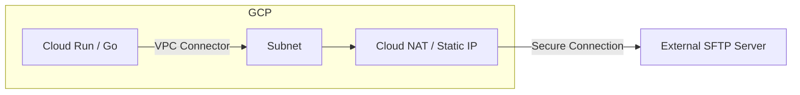
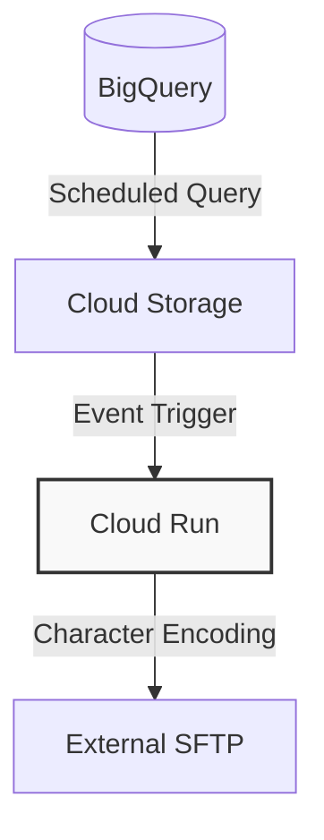

## 🛠 Cloud Native Design Patterns (GCP / IaC)

Architectural Assets サーバーレス環境における「疎結合」と「堅牢性」を両立するための、汎用的な実装パターン集です。

### Pattern 01: Legacy Integration & Egress Control

Cloud Run から外部レガシー環境（SFTP/FTPS）へのセキュアな接続パターン。

* **課題:** サーバーレス環境から外部接続先への「送信元IP固定化」と「レガシープロトコル対応」。
* **解決策:** Cloud Run + VPC Connector + Cloud NAT による固定IP化。Go言語による軽量かつ高速なSFTPクライアント実装。
* **IaC:** 全インフラを Terraform / Cloud Run 構成としてコード管理。

---

### Pattern 02: Event-Driven Data Pipeline (Rendering & Transfer)

GCS発火によるデータの文字コード変換および転送パイプライン。

* **フロー:**
1. **Scheduled Query:** BigQueryから定期的にデータを抽出。
2. **GCS Storage:** 抽出データをUTF-8で格納。
3. **Cloud Storage Trigger:** 格納を検知し、Cloud Runを発火。
4. **Processing:** Go / Python にて **UTF-8 → SJIS** へのレンダリングを実施。
5. **Data Delivery:** 完成したファイルを外部SFTPサーバーへ格納。

* **運用性:**
* 疎結合な設計により、特定ステップでの「リラン（再実行）」が可能。
* Cloud Logging による詳細なエラー検知とリカバリ設計。

---

### 📝 IaC & Security Policy

* **Infrastructure as Code:** 全環境（Networking, Compute, IAM）の構成をIaCで一元管理し、環境構築の迅速化と構成のドリフトを防止。
* **Reliability:** 冪等性を考慮したスクリプト設計により、障害発生時の迅速な復旧（リラン）を保証。

---
