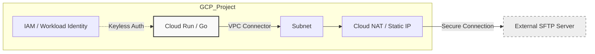
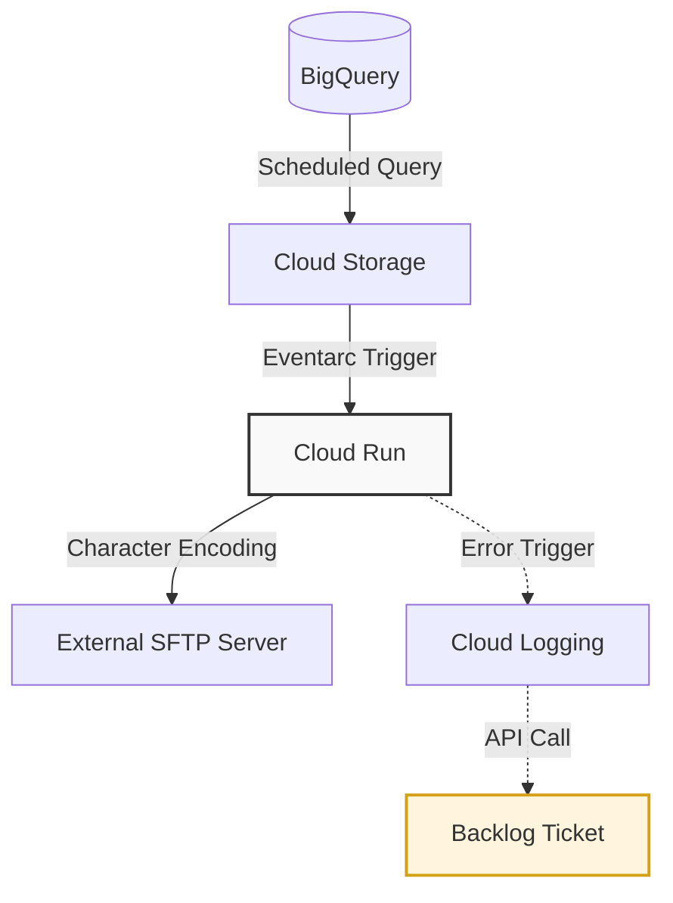

## 🛠 Cloud Native Design Patterns (GCP / IaC)

### Architectural Assets

サーバーレス環境における「疎結合」と「堅牢性」を両立するための、汎用的な実装パターン集です。現場の制約の中で、いかに「仕組み」で品質を担保するかに主眼を置いています。

---

### Pattern 01: Legacy Integration & Egress Control

Cloud Run から外部レガシー環境（SFTP/FTPS）へのセキュアな接続パターン。

* **課題:** サーバーレス環境からの「送信元IP固定化」と、外部環境へのセキュアな認証管理。
* **解決策:** Cloud Run + VPC Connector + Cloud NAT による固定IP化。Go言語による軽量なSFTPクライアント実装。
* **コントローラビリティ:**
* **Infrastructure Readiness:** 現場環境（Linux/CLI主導）に合わせつつ、**個人検証環境にて全リソースの Terraform 化を完了済み**。いつでもコードベース管理へ移行可能な「型」を保持。
* **Zero Static Keys:** 認証に秘密鍵を直接埋め込まず、GCP/AWS間の連携は **Workload Identity (IAM/OIDC)** を前提とした、鍵を持たない（Keyless）設計を推奨。
* **Centralized Params:** 接続先パスやID等の可変情報は JSON パラメータとして分離。環境変化時には設定の修正と再デプロイのみで即応。

---

### Pattern 02: Event-Driven Data Pipeline (Rendering & Transfer)

GCS発火によるデータの文字コード変換および配送パイプライン。

* **フロー:**
1. **Extraction:** BigQueryから定期的にデータを抽出。
2. **Detection:** GCSへの格納を Eventarc で検知し、Cloud Run を発火。
3. **Processing:** Go / Python にて文字コード変換（SJIS対応）等のビジネスロジックを実行。
4. **Delivery:** 完成したファイルを外部SFTPサーバーへ配送。

* **構造上の強み:**
* **完全な冪等性（Idempotency）:** 処理が中断しても、ファイルを再配置するだけで「リラン（再実行）」が可能。
* **ステートレス設計:** 処理状態をアプリ内に保持しないため、環境不備があっても Cloud Run を再デプロイ（コマンド1発）するだけで即時復旧。
* **Log Standardization:** 自作の**ログ出力用共通シェルスクリプト**を全工程に差し込み。OS層・アプリ層問わず共通フォーマットで出力し、トラブルシュートの可読性を強制。
* **Backlog Traceability:** 構造化ログ（JSON）をベースに、エラー時は Cloud Logging から Backlog API を叩き、**「エラー箇所」と「再実行手順」を記したチケットを自動起票**。

---

### 📝 Engineering Policy

* **Command-Line First:** 100%コマンドラインから再現可能な実装を徹底。管理画面の「ポチポチ」による設定のドリフトを構造的に排除。
* **Zero Trust Auth:** キーペアの発行を最小化し、クラウド間連携は IAM / ARN の論理的な紐付けによる認証を優先。
* **Reliability:** 「壊れても再デプロイで直る」「ファイルを置けばリランできる」という、現場運用の心理的安全性を最大化する設計。

---
