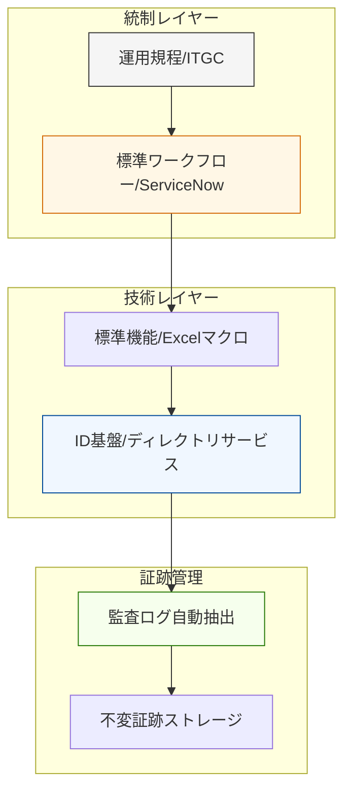

# Case Study 02: 大規模エンタープライズにおけるID統制と運用管理

### 📌 プロジェクトの背景

* **Domain:** 国内最大手製造業（大手製造業）
* **Context:** 数万人規模の組織における、厳格なガバナンス下でのID運用。
* **Approach:** 徹底された統制環境（スクリプト制限下）において、標準機能と論理的な手順管理のみで「不備ゼロ」の運用を確立。

### 🏗 構造化のアーキテクチャ

規律を重んじる環境での経験が、現在のセキュアな自動化設計の「規律」となっていることを視覚化。

### 🎯 運用の要諦

* **制約下の最適化:** 独自ツールの使用が制限される中で、既存アセットを組み合わせて「誰がやっても同じ結果が出る」構造を構築。
* **証跡の自律性:** 監査時に慌てることのないよう、日々の運用ログが自動的にアーカイブされる仕組みを重視。

---
