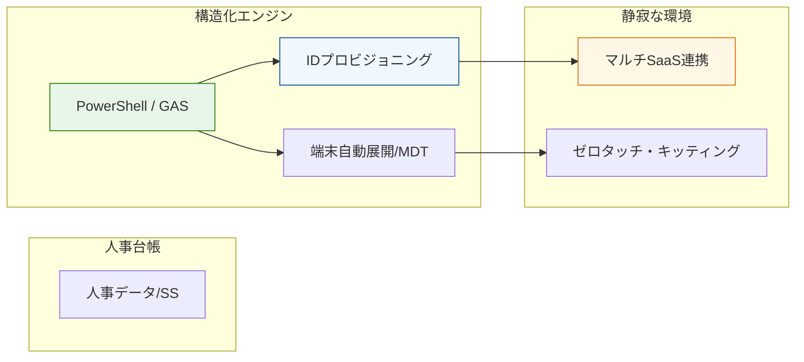

# Case Study 03: ITインフラの構造化と運用の自律化

### 📌 プロジェクトの背景

* **Domain:** ヘルスケア・プラットフォーム事業（メディカルテック大手）
* **Context:** 急激な組織拡大に伴う運用属人化の解消と、管理コストの最適化。
* **Approach:** PowerShell/GASを用いたID連携および、MDT（Microsoft Deployment Toolkit）による端末展開の自動化を自力実装。

### 🏗 構造化のアーキテクチャ

「手作業を仕組みで解決する」姿勢を、コードとドキュメントを主軸に置いたフローで視覚化。

### 🎯 運用の要諦

* **脱・属人化:** 全ての自動化タスクをドキュメント化し、誰でも運用可能な「仕組み」へ昇華。
* **爆速開発の礎:** この時期に培った「自らコードを書いて解決する」経験が、現在の生成AIを駆使した超効率的な運用スタイルの原点となっている。
* **実績:** 定例作業工数を約50%削減。キッティングプロセスの刷新により導入コストを20%削減。

---
