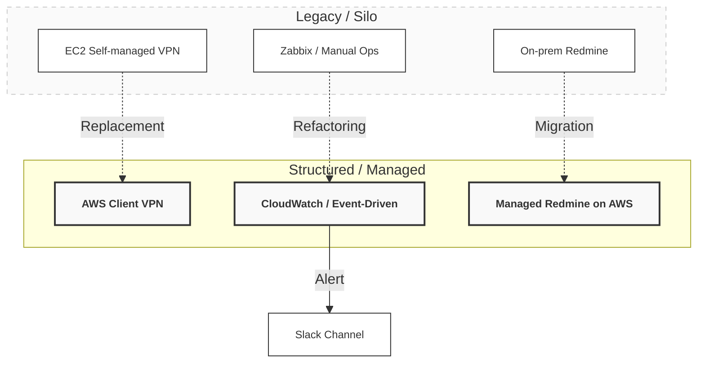

# Case Study 04

## インフラ内製化とイベントドリブン監視の再構築

（AdTech / Corporate IT / Hybrid Infra）

### 📌 プロジェクト概要

運用・監視・セキュリティが分断された状態から、IT基盤全体を構造として整理し直すことを目的としたプロジェクト。

* **領域:** コーポレートIT / オンプレミス × クラウド
* **期間:** 約1年半
* **役割:** インフラ刷新・内製化リード

---

### 🏛 設計スタンス

「部分的な改修ではなく、構造の整理を優先する」

1. **実態のない仕組みの廃止:** 運用者が不在で機能していない既存システムは維持しない。
2. **マネージドサービスの積極採用:** クラウドで解決できる領域はAWSへ委ねる。
3. **完遂の定義:** 技術的な実装だけでなく、ドキュメント化と引き継ぎまでを設計のゴールとする。

---

### 🏗 構造の再定義（Before / After）

---

### 🛠 実装ハイライト

#### 1. 監視基盤の刷新

既存の Zabbix を停止し、Amazon CloudWatch を導入。アラーム発生時に Slack のエンジニアチャンネルへ即時通知するイベントドリブンな仕組みへ移行。

* **効果:** 障害の「事後把握」から「即時検知」へ。スパイクを考慮したメトリクス設計により可視性を向上。

#### 2. 認証・アクセス経路の統合

EC2 での自前 VPN 運用を廃止し、AWS マネージド VPN へ移行。認証・権限管理を集約し、属人化と監査リスクを低減。

#### 3. 業務基盤のクラウド移行

オンプレミスの Ruby 製 Redmine を AWS へ移行。バックアップ・可用性構成を再設計し、インフラ運用の工数を削減。

#### 4. コーポレートITの基盤整備

* **Security:** ESET / Malion の全社展開と運用ルールの整備。
* **Automation:** 端末キッティングを手動から自動スクリプト（Python/Bash）へ移行。
* **Governance:** 全構成・判断基準を Google Sites へ集約し、可視化。

---

### 📊 到達点

* **監視:** 受動から能動へ。障害初動の劇的な短縮。
* **品質:** セキュリティ・監査耐性の向上と、IT運用の内製化を完了。
* **評価:** **部長賞 受賞 / 人事評価 S**

---

### 📝 総括

IT運用を“場当たり的な対応”から、一つの「構造」として扱う段階へ引き上げた取り組み。

---
