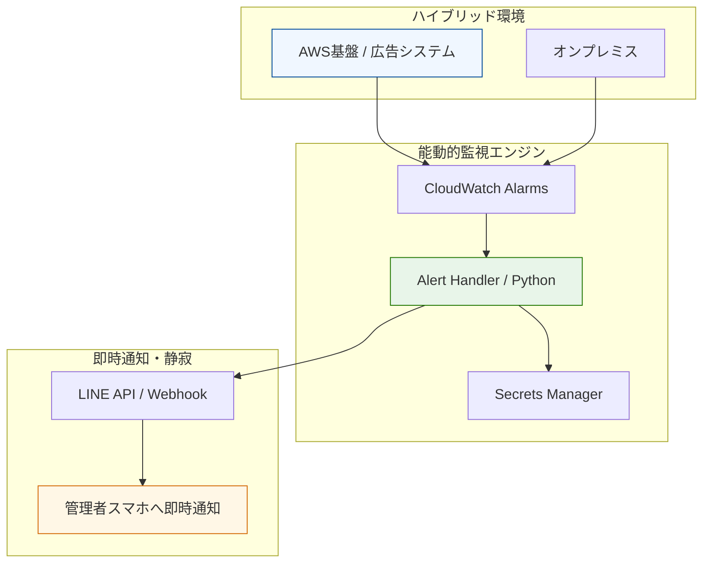

# Case Study 04: インフラ内製化とイベントドリブン監視の構築

### 📌 プロジェクトの背景

* **Domain:** アドテクノロジー事業会社
* **Context:** 外部依存によるリードタイムの遅延と、ユーザー申告で障害を知るという受動的な監視体制の刷新。
* **Approach:** クラウドネイティブな監視基盤への移行、およびサーバーレス技術を用いた「異常検知・即時通知システム」を自力実装。

### 🏗 構造化のアーキテクチャ

「インフラを資産に変える」という思想のもと、検知から通知までが数秒で完結する能動的監視フローを視覚化。

### 🎯 運用の要諦

* **攻めの監視:** 監視サーバー自体のメンテナンス工数を排除するため、完全サーバーレス（Lambda）構成を選択。
* **セキュリティの鉄壁化:** Akamai ETP等の導入により、エンドポイントセキュリティを現代的な基準へアップデート。
* **実績:** 障害検知から初動までのリードタイムを大幅に短縮。インフラ内製化によりキャッシュアウトを抑制し、社内IT環境の機動性を向上。

---
