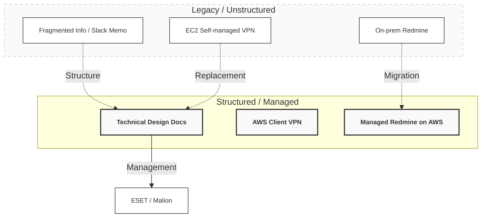

# Case Study 04: インフラ内製化とイベントドリブン監視の再構築
（AdTech / Corporate IT / Hybrid Infra）

## 📌 プロジェクト概要

運用・監視・セキュリティが分断され、ドキュメントが欠落した状態から、IT基盤全体を構造として再定義・整理し直すことを目的としたプロジェクト。

* **領域:** コーポレートIT / オンプレミス × クラウド
* **期間:** 約1年半
* **役割:** インフラ刷新・内製化リード（設計・構築・テスト・本番実装を一貫して担当）

---

## 🏛 設計スタンス

「不確実な現状を整理し、構造としての安定を取り戻す」

1. **情報の再構築:** 散在するSlackのログと口頭説明のみの状態から、実機調査を経て現新比較・設計書を起票。
2. **一気通貫の責任:** 設計・テストから、STG/本番環境の実装・切り替えまでを単独で完遂。
3. **完遂の定義:** 技術的な実装に加え、ESET/Malion等のエンドポイント運用設計を含めた「持続可能な基盤」をゴールとする。

---

## 🏗 構造の再定義（Before / After）

---

## 🛠 実装ハイライト

### 1. 情報の言語化と設計（リバースエンジニアリング）

当時のマネージャーからの口頭説明とSlack上の断片的なメモを唯一のソースとし、実機調査から設計・テスト・実装までを担当。不明瞭だったインフラ構成を可視化し、再現可能なドキュメントへと昇華させた。

### 2. 監視・アクセス基盤の刷新

既存の Zabbix を停止し、CloudWatch によるイベントドリブン通知へ移行。また、EC2 での自前 VPN 運用を廃止し、AWS マネージド VPN へ統合。認証・権限管理の集約により、監査リスクを低減。

### 3. 業務基盤のクラウド移行

オンプレミスの Ruby 製 Redmine を AWS へ移行。バックアップ・可用性構成を再構築し、物理故障リスクから解放。

### 4. セキュリティ・エンドポイント整備（内製化）

* **ESET / Malion:** 導入から全社展開、運用ルールの策定までを一貫して実施。
* **Automation:** 端末キッティングを手動から自動スクリプト（Python/Bash）へ移行。
* **Governance:** 監査証跡に耐えうるログ管理体制を構築。

---

## 📊 到達点

* **監視:** 受動から能動へ。障害初動の劇的な短縮。
* **品質:** セキュリティ・監査耐性の向上と、IT運用の完全内製化。

---

## 📝 総括

断片的な情報を構造へと落とし込み、IT運用を“場当たり的な対応”から「資産としての基盤」へと引き上げた取り組み。

---
