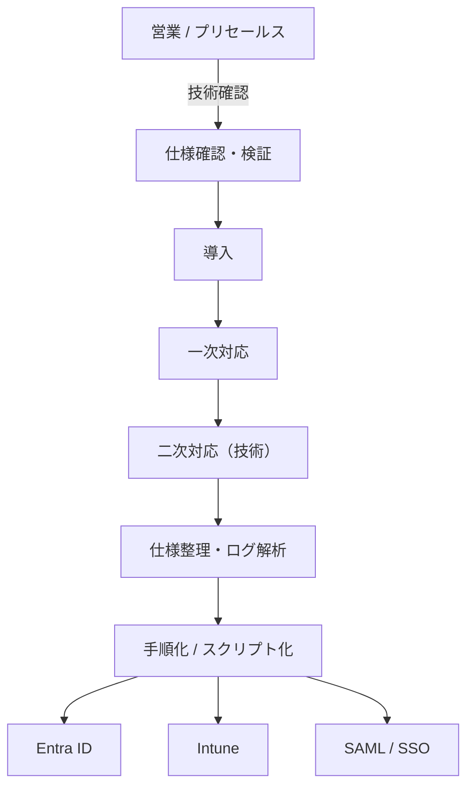

## Case Study 05  
### ID基盤・デバイス管理における技術サポートスキームの整理  
（Corporate IT / M365 / Presales–Aftersales Support）

---

### 📌 プロジェクト概要

- **Domain**：大手通信事業者グループ（法人向け支援）
- **立ち位置**：二次対応（L2）技術窓口／営業・一次対応の後方支援
- **対象領域**：
  - Microsoft 365
  - Entra ID（ID基盤）
  - Intune（デバイス管理）
  - SAML / SSO 連携
- **特徴**：プリセールスからアフターセールスまでを横断する技術支援

本プロジェクトは、  
顧客対応の前線に立つ営業・サポート担当が安心して動けるよう、  
**技術的な詰まりを裏側で整理する役割**を担った案件である。

---

### 🎯 背景

クラウドシフトの進行により、

- ID 管理（Entra ID）
- デバイス管理（Intune）
- SaaS 連携（SSO / SAML）

といった領域の仕様が急速に複雑化していた。

一方、現場は

- 営業（プリセールス）
- 一次対応（サポート）
- SV（管理）

と分業されており、  
**技術的な判断を支える裏側の整理役**が求められていた。

---

### 🏗 役割とスキーム

- 営業連携は Salesforce を通じて実施
- 表に出ない二次対応（L2）として、
  - 技術仕様の確認
  - ログ・挙動の解析
  - 再現条件・制約事項の整理
  - 回避策・代替案の提示
を担当

実態としては、  
**顧客対応窓口の背後にある技術窓口**という位置づけ。

---

### 🧩 実際に行っていたこと

#### プリセールス側（売る前）
- 商談段階での技術仕様の適合性確認
- 実現困難な要件の早期言語化
- 代替案・運用回避策の整理

→ 導入後に問題が顕在化しない状態を作る

---

#### アフターセールス側（売った後）
- 一次対応で解決できない事象の解析
- ID / 認証 / デバイス挙動の整理
- 判断ポイントの構造化

→ 現場が迷わない形に落とす

---

#### 二次対応基盤の整備
- 頻出する手作業のスクリプト化
- 手順・判断基準のドキュメント化
- 一次対応チームが自走できる状態を支援

---

### 🧠 技術的な視点として得られたもの

- Google Workspace（旧 G Suite）を含む  
  **ID 基盤設計の全体像**
- SAML / SSO における
  - 設定と運用の差分
  - 問い合わせが発生しやすいポイント
- 「設定できる」ではなく  
  **「継続運用できる」認証設計**という視点

これらは、後続のアーキテクチャ設計に直接つながっている。

---

### チーム内での関わり方

プロジェクト後半では、

- 技術的に詰まっている実装の確認
- 前提条件やロジックの整理
- 静かなコードレビュー

を通じて、  
**議論が過熱せず、前に進める状態を保つ**役割を担った。

---

### その後の接続

本プロジェクトで得た

- ID / 認証を軸とした設計視点
- プリ・アフターを横断する技術整理の経験

は、その後の再学習を経て、  
**インフラとアプリケーションを横断するハイブリッドな役割**へと接続している。

---
