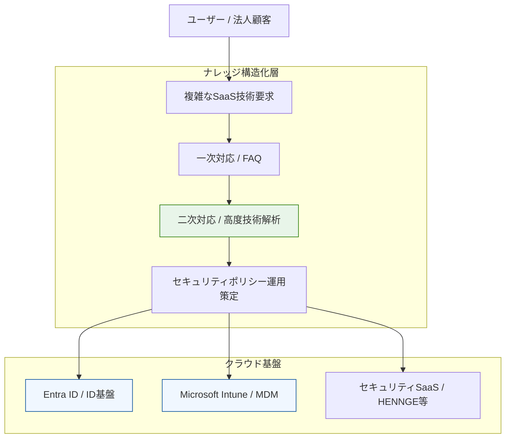

# Case Study 05: ID基盤・デバイス管理における技術サポートスキームの構築

### 📌 プロジェクトの背景

* **Domain:** 大手通信事業者グループ（法人向け支援）
* **Context:** クラウドシフトに伴う、ID管理（Entra ID）およびエンドポイント管理（Intune）の複雑な仕様への対応。
* **Approach:** クラウド製品仕様の徹底的な構造化と、高度な技術トラブルを迅速に解決するための「二次サポート体制」のスキーム定義。

### 🏗 構造化 アーキテクチャ

「ユーザー要求」というカオスを、製品仕様の深い理解によって「解決策」へと変換するナレッジフローを視覚化。

### 🎯 運用の要諦

* **製品仕様の深掘り:** 膨大な主要SaaS（グループウェア等）製品仕様を網羅的に把握。現在のセキュアなインフラ設計において、「何ができて何ができないか」を判断する確かな土台を形成。
* **仕組みによる解決:** 属人的なトラブルシューティングではなく、二次対応の立ち上げを通じて解決プロセスを体系化。
* **現在の視点:** ここで得た「ユーザー目線での仕様把握」が、現在のAI/自動化設計における「実用的なガバナンス設計」の源泉となっている。

---
