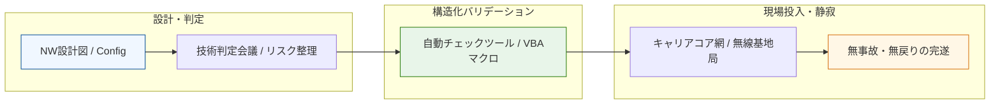

# Case Study 06: 社会インフラ級ネットワークの設計および変更管理

### 📌 プロジェクトの背景

* **Domain:** 大手通信事業者（キャリア）
* **Context:** 数百万ユーザーに影響を及ぼす基盤ネットワーク（モバイルバックホール）の設計・切替工事の完遂。
* **Approach:** ミスが許されない社会インフラにおいて、VBAマクロ等を用いた設定値チェックの自動化と、多角的なステークホルダー間の技術調整を主導。

### 🏗 構造化のアーキテクチャ

「設計」から「現場投入」までの間に厳格なバリデーション層を設け、ヒューマンエラーを物理的に排除するフローを視覚化。

### 🎯 運用の要諦

* **堅実な運用を技術で支える:** 膨大な設定値の投入において、手作業を最小限にするためのチェック機構を自作。この「正確な作業を支援する仕組み作り」が、現在の自動化スキルの原点。
* **ステークホルダー調整:** グローバルベンダーを含む多様な関係者と足並みを揃え、リスク箇所を事前に構造化して共有することで、円滑な合意形成を実現。
* **実績:** 長期間にわたり、重大事故や工事戻りのない安定した現場運営を継続。大規模インフラ工事における「絶対的な安心感」を構築。

---