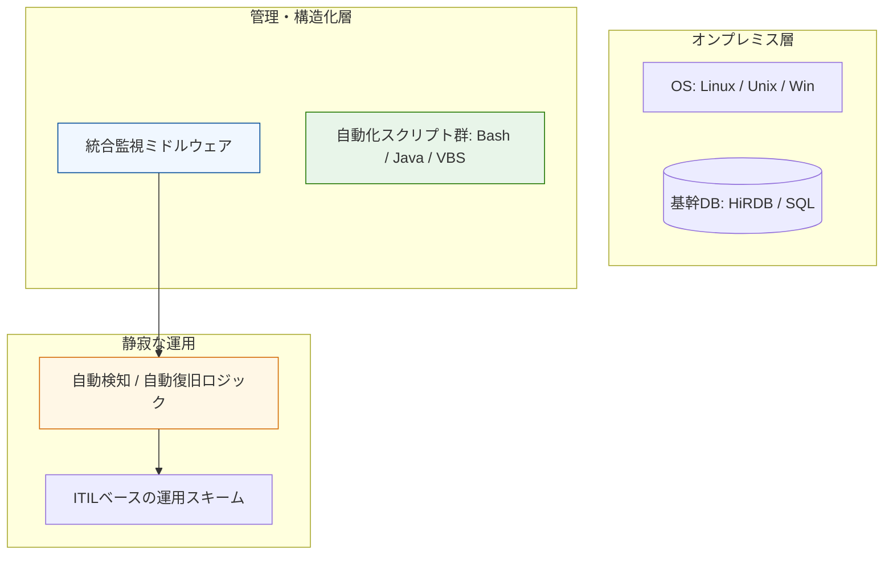

### ■ PJT 07: ミッションクリティカル監視・運用基盤

```markdown
# Case Study 07: エンタープライズ統合監視・運用基盤の設計実装

### 📌 プロジェクトの背景
- **Domain:** 大手システムインテグレーター（公共・金融系）
- **Context:** 極めて高い信頼性が求められる大規模オンラインシステムの監視要件定義および運用基盤構築。
- **Approach:** 統合監視ミドルウェア（JP1等）の高度な設計に加え、OS・DBレイヤーを横断する自動化スクリプト群（Bash/VBS/Java）を自ら提案・実装。

### 🏗 構造化のアーキテクチャ
OSからミドルウェアまでが密結合するオンプレミス環境において、運用の「型」をスクリプトで定義し、安定稼働を実現するフローを視覚化。



### 🎯 運用の要諦

* **インフラの真髄の習得:** OS、DB、NW、セキュリティが物理・仮想レイヤーでどう噛み合っているかを徹底的に深掘り。この「低レイヤーの深い理解」が、現代の堅牢なクラウド設計を支える確かな土台となっている。
* **提案型エンジニアリング:** 既存の運用体制の欠如に対し、監視基盤の「開発」工程を自ら提案・受注。受動的な保守ではなく、能動的な品質向上を断行。
* **実績:** 5年間の長期参画を通じ、ミッションクリティカルな環境に耐えうる高度な技術スキルを確立。顧客の新規システム受注を技術面から強力にバックアップした。

