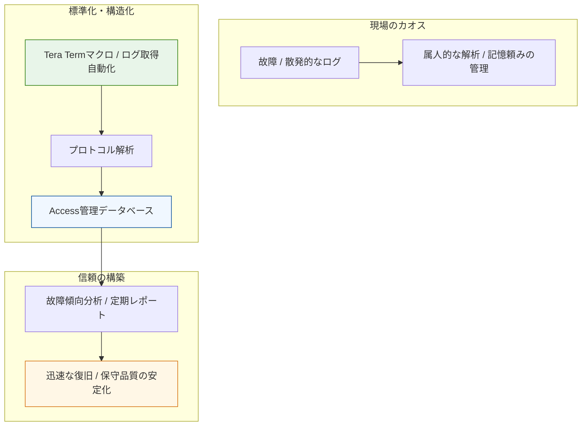

# Case Study 08: 国内初の大規模広域ネットワーク保守体制の立ち上げ

### 📌 プロジェクトの背景

* **Domain:** 大手電気通信事業者（ISP / キャリア）
* **Context:** 国内初となる大規模広域LANシステムの保守拠点立ち上げ、および前例のない運用プロセスの構築。
* **Approach:** 現場でのログ解析を効率化するマクロ（Tera Term等）の作成や、Microsoft Accessを用いたインシデント・在庫管理データベースの自社開発。

### 🏗 構造化のアーキテクチャ

「日本初」という未知のトラブルに対し、物理層からアプリケーションログまでを「DBと自動化マクロ」で一気通貫に管理する構造を視覚化。

### 🎯 運用の要諦

* **現場主義の改善:** 物理故障からルーティングプロトコル解析までを網羅。現場で発生する「非効率」をコードとDBで即座に解決するスタイルを確立。
* **属人性の徹底排除:** 「誰が対応しても同じレベルの回答ができる」状態を目指し、在庫管理から過去のトラブル事例までをDB化。
* **インフラエンジニアとしての基礎体力:** ネットワークが社会基盤（インフラ）となる過渡期において、故障対応の迅速化がエンドユーザーの信頼に直結することを実体験として学習。現在のあらゆる自動化・構造化設計の根底にある「責任感」の源泉。

---