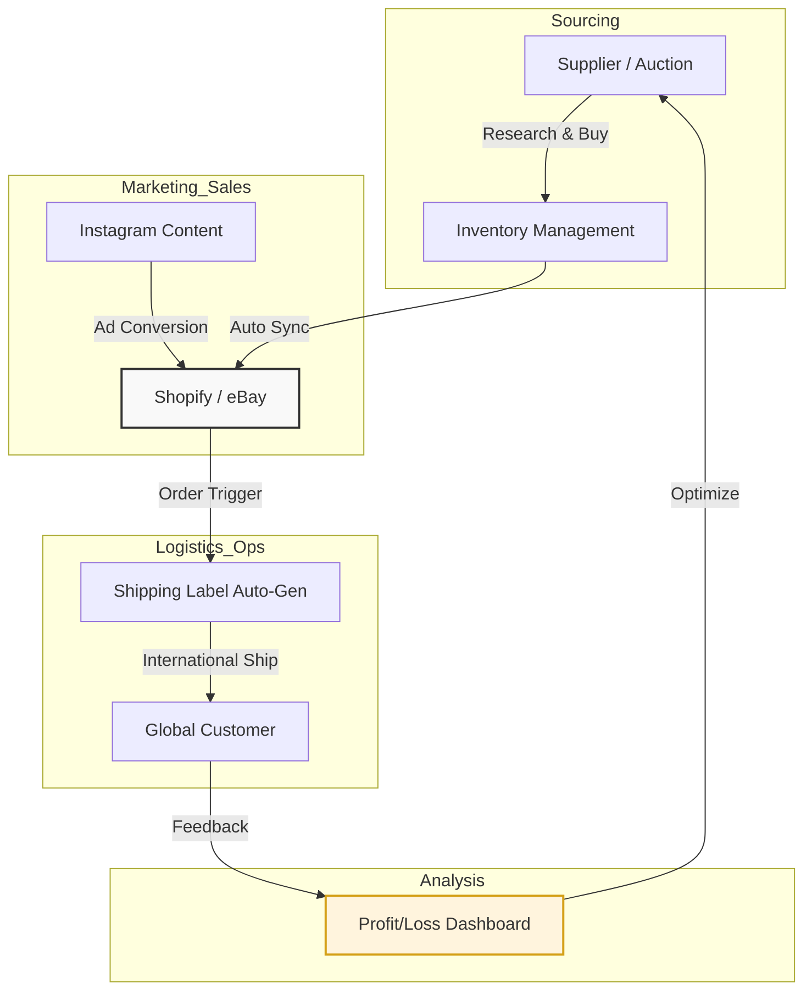

# 📦 Project 09: Solo Supply Chain & EC Operations

### Overview

エンジニアリングの枠を超え、個人事業主として「仕入れ・集客・販売・配送」の全工程を一人で完結させる**一人サプライチェーン**を構築・運用。
「自分のリソースをいかに技術で浮かせるか」をテーマに、ビジネス課題を技術（自動化/IaC）で解決する、現場主義のアーキテクチャを実践しています。

---

### 🛠 Business & Tech Stack

* **EC Platforms:** eBay (Global Export), Shopify (D2C), Instagram Shopping
* **Marketing:** Instagram Ads / Meta Business Suite
* **Automation:** Python / Shell Script (Inventory & Listing Management)
* **Data Analysis:** Google Sheets / App Script (Profit & Logistics tracking)

---

### 🔄 One-Man Supply Chain Flow

ビジネスの全工程を、極力手作業を排除した「仕組み」として定義しています。

---

### 🚀 Key Philosophies & Implementation

* **「自分の工数を浮かせる」ための自動化**
副業・兼業という限られた時間で成果を出すため、在庫更新や出品作業、国際配送ラベルの発行などをスクリプトで自動化。「ポチポチ作業」を構造的に排除し、自分自身を**「運用担当」から「仕組みの管理者」**へとシフトさせています。
* **Workload Identity / Security Policy**
ShopifyやeBayのAPI連携において、静的なセキュリティキーの管理を最小化。クラウド連携（GCP/AWS等）の知見を活かし、セキュアで疎結合なデータ連携を意識しています。
* **Idempotency (冪等性) の確保**
大量の商品データ更新において、二重出品や在庫の不整合を防ぐため、リラン（再実行）が容易で「何度やっても正しい状態に戻る」処理ロジックを自作ツールに組み込んでいます。

---

### 📝 Project Learning (The Why)

システムが解決すべきは常に「現場の痛み」です。
自らリスクを取って商売を回すことで、エンジニアの視点だけでは見落としがちな**「物流の不確実性」**や**「顧客体験の重要性」**を実感を伴って理解しています。

この「ビジネスの全体像を俯瞰し、技術で整地する」感覚が、私のエンジニアとしての土台（JP1/ITIL）と最新技術（Cloud Native）を繋ぐミッシングリンクとなっています。

---

### 💡 補足情報

* **eBay Store:** [analogcamerajp](https://www.ebay.com/usr/analogcamerajp)
* **Instagram:** [@analogcamera.jp](https://www.instagram.com/analogcamera.jp/)

---
